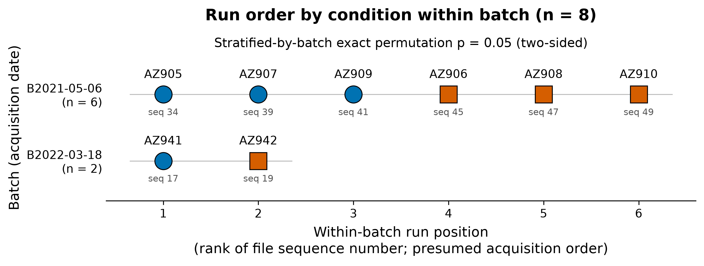
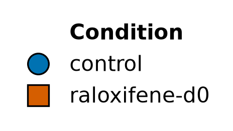
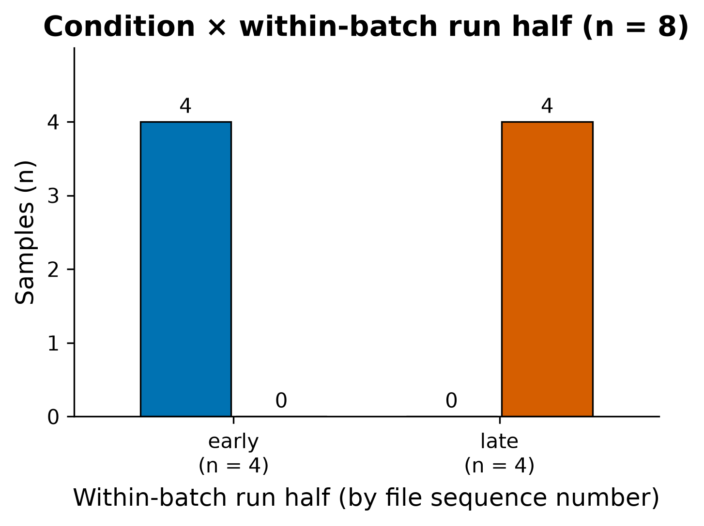

# Run order is aliased with condition: every control was run before every raloxifene-d0 sample within each batch

## Summary
In both acquisition batches, every control run comes before every raloxifene-d0 run when runs are ordered by file sequence number, which is presumed to be injection order. The separation is complete (stratified exact permutation, U = 10/10, rank-biserial = 1.00, p = 0.05 two-sided). Any drift over an acquisition sequence therefore coincides with the treatment contrast.

## Verdict
This is a design caveat, recorded as a candidate. It is not a claim about biology. If sequence number is injection order, a within-run technical trend such as sensitivity loss, column aging or carry-over cannot be separated from the raloxifene effect. A trend like that could look like a treatment effect or hide one. No pooled-QC injections exist, so drift cannot be measured independently of treatment. Downstream differential results must be read in that light.

## Evidence

**Controls run first, raloxifene-d0 runs last, in every batch.** In B2021-05-06, positions 1–3 are the controls AZ905, AZ907 and AZ909 (seq 034, 039, 041), and positions 4–6 are the raloxifene-d0 samples AZ906, AZ908 and AZ910 (seq 045, 047, 049). In B2022-03-18, control AZ941 (seq 017) ran before raloxifene-d0 AZ942 (seq 019). A stratified exact permutation test permutes condition within each batch and sums the per-batch U. It gives U = 10/10 and rank-biserial = 1.00 (control earlier), with p = 0.05 two-sided (2 of 40 joint permutations are as extreme). No arrangement could be more extreme. The direction was not pre-specified, so the two-sided value is the primary one; the one-sided value, 0.025, is for reference only. B2021-05-06 alone gives U = 9/9 and p = 0.10 two-sided (2/20). The 1-vs-1 B2022-03-18 pair carries no information by itself, but it does contribute to the joint enumeration.

*Figure 1. Within-batch run layout. Produced by `scripts/promoted/metadata_figures.py` (536281b) from data `sha256:bc6b73d3…1ba74` (inputs `results/metadata/run_layout.tsv`, `results/metadata/hypotheses.tsv`).*

Each row is one acquisition batch, and each marker is one run placed at its rank in the file-sequence order. In the upper (2021) row, all three blue control circles sit on the left and all three orange raloxifene squares on the right, with no interleaving. The lower (2022) row repeats the pattern, blue first and then orange. Complete separation in both batches is what drives the stratified p = 0.05.

**The same aliasing, summarized as run halves.** When each batch is split into an early and a late half, the early half holds all 4 controls and no raloxifene samples, and the late half holds all 4 raloxifene samples and no controls. Cramér's V for condition × run half is 1.00, both raw and bias-corrected. At n = 8 this V is unstable and serves only as descriptive context; the permutation test above is the primary evidence.

*Figure 2. Condition × run half. Produced by `scripts/promoted/metadata_figures.py` (536281b) from data `sha256:bc6b73d3…1ba74` (input `results/metadata/crosstab_condition_run_half.tsv`).*

The early group has only a blue control bar of height 4 and a zero-height orange bar. The late group is the mirror image, with only the orange bar of height 4. Run half predicts condition perfectly. No early/late comparison is free of treatment, and no treatment comparison is free of run position.

## Methods / how to produce
The numbers come from `scripts/promoted/metadata_characterize.py` at commit `536281b19d36d10a32d6920ede7e2f7e01944f52` on data `sha256:bc6b73d30e40d6ec190f8cd4494ec58d984a475f670d5aab5d8b238974d1ba74`. The environment is `pyproject.toml` + `uv.lock` on Python 3.12.3. Outputs are `results/metadata/hypotheses.tsv` (H4 rows), `results/metadata/associations.tsv` (condition × run_half), `results/metadata/crosstab_condition_run_half.tsv` and `results/metadata/run_layout.tsv`. Batch, sequence number and run position are parsed from the mzML file names in `data/metadata.tsv` (`UWPRExp480_<YYYY>_<MMDD>_AZ_<NNN>_<AZnnn>_AZ_complex.mzML`). The test permutes condition labels independently within each batch, enumerates all 40 joint assignments exactly, and uses the sum of per-batch Mann–Whitney U as the statistic. Figures come from `scripts/promoted/metadata_figures.py` at the same commit. The sample set is all 8 runs, all experimental; no QC or pool controls exist, so none are excluded.

## Discussion
Suppose the sequence numbers reflect injection order. Then the treatment contrast is fully aliased with position in the acquisition sequence. A monotone technical trend across a run would show up as a condition difference. This dataset is meant to act as a near-null test of the differential pipeline (`state/PROJECT.md`), so this matters most for exactly the outcome the project is watching for. A spurious "raloxifene effect", especially a global intensity or identification-count shift, would be an artifact that the design itself can produce. The same trend could also cancel a real small effect.

## Caveats
- **Injection order is presumed, not confirmed.** The scientist does not know whether the file sequence number is injection order. Acquisition start timestamps in the mzML files could confirm or refute it. If they refute it, this caveat weakens or disappears.
- **Drift cannot be measured independently.** There are no pooled-QC or reference injections, so a run-order trend cannot be estimated separately from treatment. Any within-condition trend can be examined only across 3 runs, or 1 in the 2022 batch.
- **Small n.** At n = 8, p = 0.05 is the smallest two-sided p the stratified test can reach. Cramér's V is unstable in both forms.
- **Multiplicity context.** This is one of five design hypotheses (H1–H5) checked during Stage 1 characterization (`state/METADATA.md`). It is descriptive of the cohort and makes no held-out claim. No correction was applied because it is a caveat, not a discovery.
- **Integrity gate not yet passed.** `integrity_signoff: false` until Stage 3 certifies the sample↔metadata pairing this rests on.

## Follow-ups
- Confirm injection order from mzML acquisition start timestamps.
- **Stage 3 QC:** plot per-run total intensity, identification counts and missingness against run position (within batch). Check whether any trend follows run position within condition, not only between conditions.
- **Stage 4:** treat any differential signal skeptically, especially a global shift. Report whether hits are consistent with a monotone run-position trend. Discoveries affected by this should link back here with a `relates_to` edge.

## Related findings
- [Finding 0002 (unequal two-batch structure)](0002-two-acquisition-batches-6-vs-2.md) — `relates_to`. Both caveats describe acquisition structure. The 2022 pair from that finding also ran control-first, and it adds to the stratified run-order test here.

## References
None yet. The interpretive statements on LC-MS run-order drift are general domain background and do not yet have citations.
