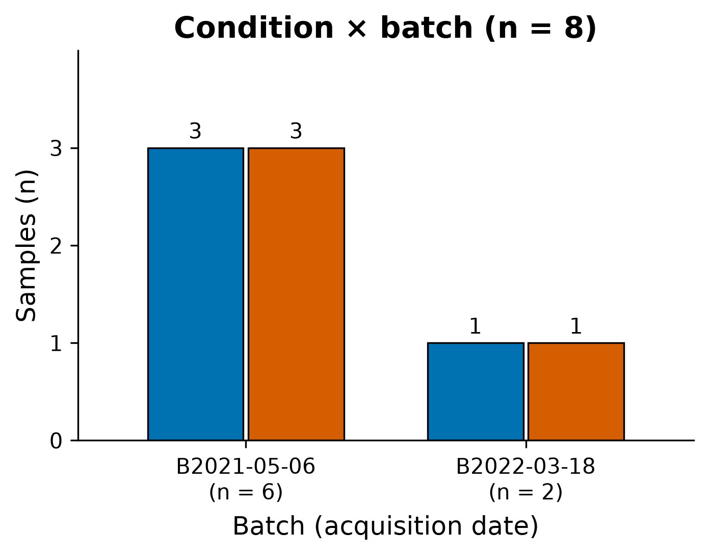
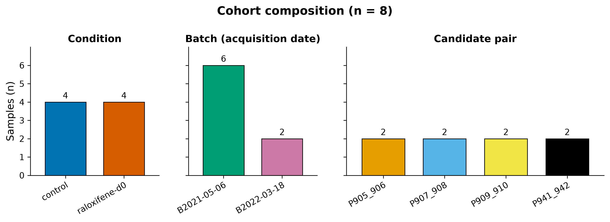
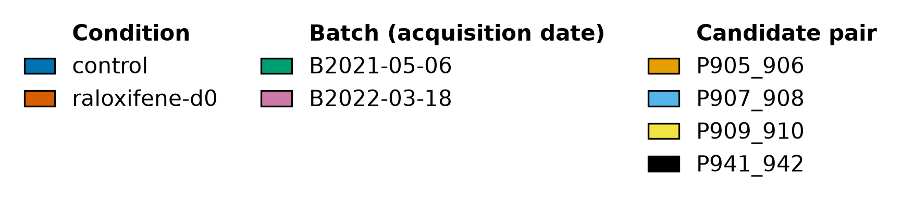

# Unequal two-batch structure of unknown nature: 6 runs on 2021-05-06 vs 2 runs on 2022-03-18

## Summary
The 8 runs were acquired on two dates, which serve as a proxy batch. B2021-05-06 has 6 runs (3 control + 3 raloxifene-d0) and B2022-03-18 has 2 runs (1 + 1), about 10 months later. Condition is balanced within each batch, so batch does not bias the contrast directly. The batch is unequal, its nature is unknown, and its effect can be estimated from only one pair.

## Verdict
This is a design caveat, recorded as a candidate. Batch is not confounded with condition (Cramér's V = 0.00). The risk is variance and interpretability rather than bias. A 10-month gap can bring a large technical difference (instrument state, column, calibration, and possibly sample prep). Such a difference would inflate within-group variance and could dominate PCA or clustering. The later batch has one sample per arm, so its batch effect is estimable only from that one pair and cannot be separated from that pair's own biology.

## Evidence

**Condition is balanced within batch, but the batches are unequal.** B2021-05-06 holds 3 control and 3 raloxifene-d0 runs. B2022-03-18 holds 1 of each. Cramér's V for condition × batch is 0.00, both raw and bias-corrected; it is unstable at n = 8 and is descriptive only. Every batch contains both conditions (H2).

*Figure 1. Condition × batch. Produced by `scripts/promoted/metadata_figures.py` (536281b) from data `sha256:bc6b73d3…1ba74` (input `results/metadata/crosstab_condition_batch.tsv`).*

Within each batch group, the blue and orange bars are the same height (3 and 3 on the left, 1 and 1 on the right). That equal height is why batch does not tilt the treatment contrast. The large difference between the left and right groups shows the 6-vs-2 imbalance: the 2022 batch amounts to a single control–raloxifene pair.

**Cohort composition by condition, batch and candidate pair.** The same imbalance appears next to the balanced condition split and the four candidate pairs. Candidate pairs are consecutive sample IDs (905/906, 907/908, 909/910, 941/942). Each pair holds one control (odd ID) and one raloxifene-d0 (even ID) (H3; V condition × pair = 0.00). It is unknown whether a pair shares an aliquot or incubation. The B2022-03-18 batch is exactly the pair P941_942.

*Figure 2. Cohort composition. Produced by `scripts/promoted/metadata_figures.py` (536281b) from data `sha256:bc6b73d3…1ba74` (input `samples.tsv`).*

The left panel shows the balanced 4/4 condition split. The middle panel shows the 6-vs-2 batch imbalance, a tall 2021 bar against a short 2022 bar. The right panel shows four candidate pairs of 2 samples each. The last pair, P941_942, makes up the entire 2022 batch, which is why its batch effect and that pair's biology cannot be told apart. This panel shows pair sizes, not the within-pair condition split; that split is supported by the table (H3).

## Methods / how to produce
The numbers come from `scripts/promoted/metadata_characterize.py` at commit `536281b19d36d10a32d6920ede7e2f7e01944f52` on data `sha256:bc6b73d30e40d6ec190f8cd4494ec58d984a475f670d5aab5d8b238974d1ba74`. The environment is `pyproject.toml` + `uv.lock` on Python 3.12.3. Outputs are `results/metadata/crosstab_condition_batch.tsv`, `results/metadata/associations.tsv` (condition × batch, condition × candidate_pair) and `results/metadata/hypotheses.tsv` (H2, H3). Batch is the acquisition date parsed from the mzML file name (`UWPRExp480_<YYYY>_<MMDD>_…`), and candidate pair comes from consecutive `AZnnn` sample IDs. Figures come from `scripts/promoted/metadata_figures.py` at the same commit. The sample set is all 8 runs, all experimental; no QC or pool controls exist, so none are excluded.

## Discussion
A balanced batch does not bias the treatment estimate, but it still costs precision. If the 2022 pair differs systematically from the 2021 runs, that difference inflates within-condition variance in an unadjusted model. At n = 4 per arm, that could remove what little power exists. Batch could also become the first principal component and hide any condition structure in PCA or clustering, which is one of the project's stated QC goals (`state/PROJECT.md`). Modelling batch as a covariate spends one degree of freedom out of very few, and the 2022 pair alone determines the batch estimate. That is why a with/without-2022 sensitivity analysis is useful alongside it.

## Caveats
- **Batch is a proxy.** It is inferred from acquisition date. The scientist does not know whether the later pair was also prepared separately or only acquired later, so the batch may be acquisition-only or prep + acquisition.
- **Batch effect not estimable independently.** The 2022 batch is a single pair, so a batch effect cannot be separated from that pair's own biological variation.
- **Small n.** Cramér's V (0.00) is unstable at n = 8 and is descriptive only.
- **Multiplicity context.** This is one of the design hypotheses (H1–H5) examined during Stage 1 characterization (`state/METADATA.md`). It is descriptive and makes no held-out claim.
- **Integrity gate not yet passed.** `integrity_signoff: false` until Stage 3 certifies the sample↔metadata pairing.

## Follow-ups
- **Stage 3 QC:** check whether the 2022 runs (AZ941, AZ942) separate from the 2021 runs on PCA and sample–sample correlation, at both protein and peptide level.
- **Stage 4:** include batch as a covariate in differential models, and/or report results with and without the 2022 pair as a sensitivity analysis.
- **Stage 4 (related):** candidate pairs may be a blocking factor. Run a pair-as-covariate (paired) analysis as a sensitivity analysis next to the default unpaired one. Pair matching is unconfirmed.
- Ask the scientist, or check sample-prep records, whether the 2022 pair was prepared separately.

## Related findings
- [Finding 0001 (run order aliased with condition)](0001-run-order-aliased-with-condition.md) — `relates_to`. Both caveats describe acquisition structure. The run-order test in 0001 is stratified by the batches defined here, and the 2022 pair also ran control-first (AZ941 seq 017, then AZ942 seq 019).

## References
None yet. The interpretive statements on LC-MS batch effects are general domain background and do not yet have citations.
