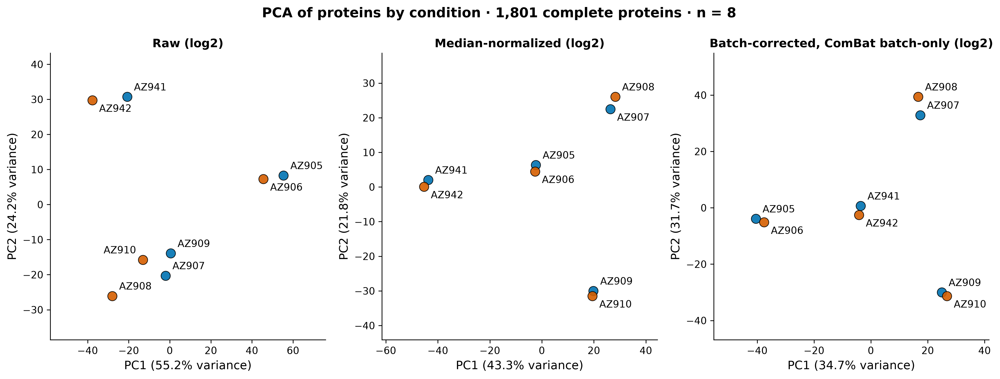

# Control/raloxifene sample pairs are the dominant structure in the data: pair should be a blocking factor

## Summary
The consecutive-ID candidate pairs are the strongest structure in the data. Each pair holds one control and one raloxifene-d0 sample. On median-normalized log2 data, the two members of every pair correlate more closely with each other than with any other sample, and this holds at the protein, peptide, NSAF and PSM-count levels. Condition does not separate samples in any processing state.

## Verdict
This is a design caveat, recorded as a candidate. It does not claim anything about biology. The most likely explanation is that each pair shares a microsome source or preparation, but that was never recorded. Stage 1 metadata showed only consecutive IDs, each pair holding one control and one raloxifene sample ([finding 0002](0002-two-acquisition-batches-6-vs-2.md)). For Stage 4, pair should be a blocking factor in differential analysis. Batch is nested in pair, so a pair term also absorbs batch, and the Stage-2 plan to model batch as a covariate should be revisited in favour of pair. The evidence is descriptive only: n = 8 and no hypothesis test.

## Evidence

**Every candidate pair clusters first.** At the protein level (1,801 complete non-contaminant proteins, median-normalized log2), the within-pair Pearson correlations are AZ905–AZ906 0.992, AZ909–AZ910 0.992, AZ907–AZ908 0.987 and AZ941–AZ942 0.986. Correlations between samples in different 2021 pairs are 0.950–0.958, and correlations across batches are 0.900–0.945. Every within-pair r is higher than every between-pair r, so average-linkage clustering joins each pair before anything else.

*Figure 1. Protein sample correlation, median-normalized log2. Produced by `scripts/promoted/qc_fig_sample_correlation.py` (module `scripts/promoted/qc_figures/correlation.py`, commit 390bfb2) from data `sha256:bc6b73d3…1ba74`, input `results/qc_states/protein/normalized_log`; provenance `results/qc_figures/sample-correlation/0003-provenance.json`.*

The dark-red 2×2 blocks on the diagonal (r 0.986–0.992) each match one color in the candidate-pair bar, and the lowest branches of the dendrogram join exactly those pairs. The condition bar alternates blue and orange within every block, so condition splits every pair rather than grouping samples. The top-level split separates the 2022 pair (pink batch) from the 2021 runs, and the cross-batch cells are the bluest in the matrix (0.900–0.945).

**The pair-first structure does not depend on the quantity.** The within-pair correlations are 0.962–0.980 for peptides (median-normalized log2), 0.958–0.967 for NSAF (log2) and 0.990–0.995 for raw PSM counts. At each level, clustering again joins the pairs first (`reports/qc-report.md` §7, §9).

**PCA shows pairs, batch and no condition effect.** On the raw log2 data, PC1 (55.2%) is driven by the AZ905/AZ906 pair, which has the highest per-sample loading. After median normalization, PC1 (43.3%) is batch: the 2022 pair on one side and all 2021 runs on the other. PC2 (21.8%) separates the three 2021 pairs from each other. The ComBat batch-only preview moves the 2022 pair to the center, which is expected when centering a 2-sample batch, and the 2021 pair-vs-pair structure then dominates. Condition does not separate on any component in any state.

*Figure 2. Protein PCA across processing states, colored by condition. Produced by `scripts/promoted/qc_fig_pca.py` (module `scripts/promoted/qc_figures/pca.py`, commit 390bfb2) from data `sha256:bc6b73d3…1ba74`, inputs `results/qc_states/protein/{raw_log,normalized_log,batch_corrected_log}`; provenance `results/stage3/figure_provenance/0003-pca.json`.*

In all three panels the points come in labeled pairs (AZ905/906, AZ907/908, AZ909/910, AZ941/942) that sit almost on top of each other, and each pair holds one blue and one orange point. In the raw panel, AZ905/AZ906 sit far to the right on PC1. In the normalized panel, AZ941/AZ942 sit alone at the far left of PC1, and PC2 spreads the three 2021 pairs apart. In the ComBat panel, the 2022 pair moves to the center. No panel has blue points on one side and orange on the other, which is why condition separates on no component.

## Methods / how to produce
Correlations and clustering come from `scripts/promoted/qc_fig_sample_correlation.py` (module `scripts/promoted/qc_figures/correlation.py`), and PCA comes from `scripts/promoted/qc_fig_pca.py` (module `scripts/promoted/qc_figures/pca.py`), both at commit 390bfb2, on data `sha256:bc6b73d30e40d6ec190f8cd4494ec58d984a475f670d5aab5d8b238974d1ba74`. Correlation uses the state `results/qc_states/protein/normalized_log` with Pearson r and average linkage (euclidean over correlation-matrix rows). PCA uses the states `raw_log`, `normalized_log` and `batch_corrected_log` (ComBat, batch label only, no covariate preserved), with standardized features and 2 components. Features are the 1,801 complete non-contaminant proteins. The peptide, NSAF and PSM-count correlations come from the Stage-3 QC run (`reports/qc-report.md` §7, §9). The environment is `pyproject.toml` + `uv.lock` on Python 3.12.3. The sample set is all 8 runs, all experimental; there are no QC or pool controls, so none are excluded.

## Discussion
A matched pair that shares a microsome source or prep carries much of the between-sample variance, far more than condition does. A paired or pair-blocked model removes that shared component from the residual, so the treatment contrast is estimated within pairs. An unpaired test leaves the component in the residual. Residual variance then grows and power drops, and with 4 samples per arm there is very little power to spare. The 2022 batch is a single pair (P941_942), so batch is nested in pair. A pair term therefore already accounts for batch, and adding batch on top would be redundant. This is the reason to revisit the Stage-2 "batch as covariate" plan. These statements about blocking and variance are general statistical background and do not yet have citations.

## Caveats
- **The pair's nature is not recorded.** "Shared microsome source or prep" is the most likely explanation, not a documented fact. Stage-1 metadata showed only consecutive IDs, with one control and one raloxifene-d0 in each pair.
- **Run order is still aliased within every pair.** The control was run first in every pair ([finding 0001](0001-run-order-aliased-with-condition.md)), so a pair-blocked contrast still carries the run-order aliasing.
- **Batch and pair are not separable for the 2022 samples.** The 2022 batch is exactly one pair.
- **Descriptive only.** n = 8 and no hypothesis test was run. The ranges are QC summaries, not estimates with intervals.
- **PCA figure shows PC1 and PC2 only.** The statement that later components separate the 2021 pairs rests on the QC run; the figure shows PC2 doing so.
- **Multiplicity context.** This is one structural observation from the Stage-3 QC (`reports/qc-report.md`). It makes no held-out claim, and no correction was applied because it is a caveat, not a discovery.
- **Integrity gate passed.** Stage 3 signed off on 2026-09-23 for this data version, so `integrity_signoff: true`.

## Follow-ups
- **Stage 4:** use pair as a blocking factor (paired design or pair covariate) in the differential model. Revisit the Stage-2 batch-covariate decision, since pair absorbs batch.
- Report an unpaired analysis only as a sensitivity comparison, if at all.
- Ask the scientist, or check prep records, what each pair shares (microsome source, prep day, incubation).

## Related findings
- [Finding 0002 (unequal two-batch structure)](0002-two-acquisition-batches-6-vs-2.md) — `relates_to`. Batch is nested in pair: the 2022 batch is exactly pair P941_942, so a pair blocking term absorbs batch.
- [Finding 0001 (run order aliased with condition)](0001-run-order-aliased-with-condition.md) — `relates_to`. The control was run first in every pair, so pair-internal contrasts still carry the run-order aliasing.

## References
None yet. The statements on paired designs and blocking are general statistical background and do not yet have citations.
