# No differential abundance between raloxifene-d0 and control; only the pair-blocked model is plausibly calibrated

## Summary
Across 4 quantities (LFQ protein, LFQ peptide, NSAF, log2 PSM counts) and 3 designs (paired, batch, unadjusted), no feature reaches BH q < 0.05. The only q < 0.10 results are 10 LFQ peptides in the paired design, and none of their proteins is a protein-level hit. Only the pair-blocked design has a plausible p-value distribution. The batch and unadjusted designs are conservative because the pair component of variance stays in their residual.

## Verdict
This is an exploratory null, recorded as a candidate. The primary model is a paired limma-style moderated t with 4 pairs and residual df 3. It finds no differentially abundant feature at q < 0.05 in any quantity. The paired p-values show a modest small-p excess (π0 0.76–0.87). At this design's resolution, that excess cannot be told apart from within-pair relabelling, and it sits mostly in low-intensity proteins, which points to a technical source. The null depends on the model: under limma-trend, ATPK and 10 peptides would pass q < 0.05. Run order is aliased with condition in every pair, so even a hit could not be attributed to treatment.

## Evidence

**No feature reaches q < 0.05, and the protein-level effects that lead the ranking are small.** In the paired design (condition + candidate_pair), the top-ranked proteins are ATPK (log2FC −0.52 [−0.69, −0.35], q 0.21), DOPD (−0.66 [−0.88, −0.44], q 0.21) and LMF1 (+0.62 [0.41, 0.83], q 0.21). Every protein has q ≥ 0.21.

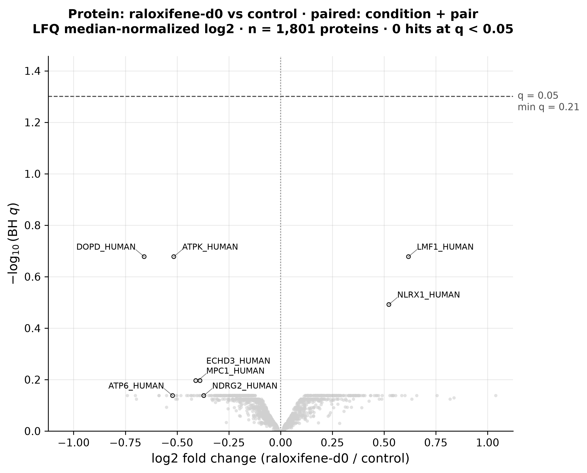

*Figure 1. LFQ protein volcano, paired design. Produced by `scripts/scratch/fig_de_raloxifene_vs_control.py` (module `scripts/scratch/analysis_figures/volcano.py`, seeded volcano@0.2, commit 416cb10) from `results/de/raloxifene-vs-control/protein_paired.tsv`, data `sha256:bc6b73d3…1ba74`.*

All 1,801 points sit well below the dashed q = 0.05 line, and the highest reaches −log10 q ≈ 0.68 (q 0.21). DOPD and ATPK on the left and LMF1 on the right are the three labelled points tied at the top. Their effects stay within about ±0.7 log2, and the bulk of the cloud lies within ±0.25.

**The only q < 0.10 results are 10 LFQ peptides.** In the paired design, 10 peptides have q 0.052–0.077 and |log2FC| 1.0–1.8. They come from UD14, LRC59, SC24C, AACT, NB5R3, TXND5, ERAP1, CATD, S2513 and ECHP, and none of those proteins is a protein-level hit. None of the 7 within-pair relabellings produced any hits.

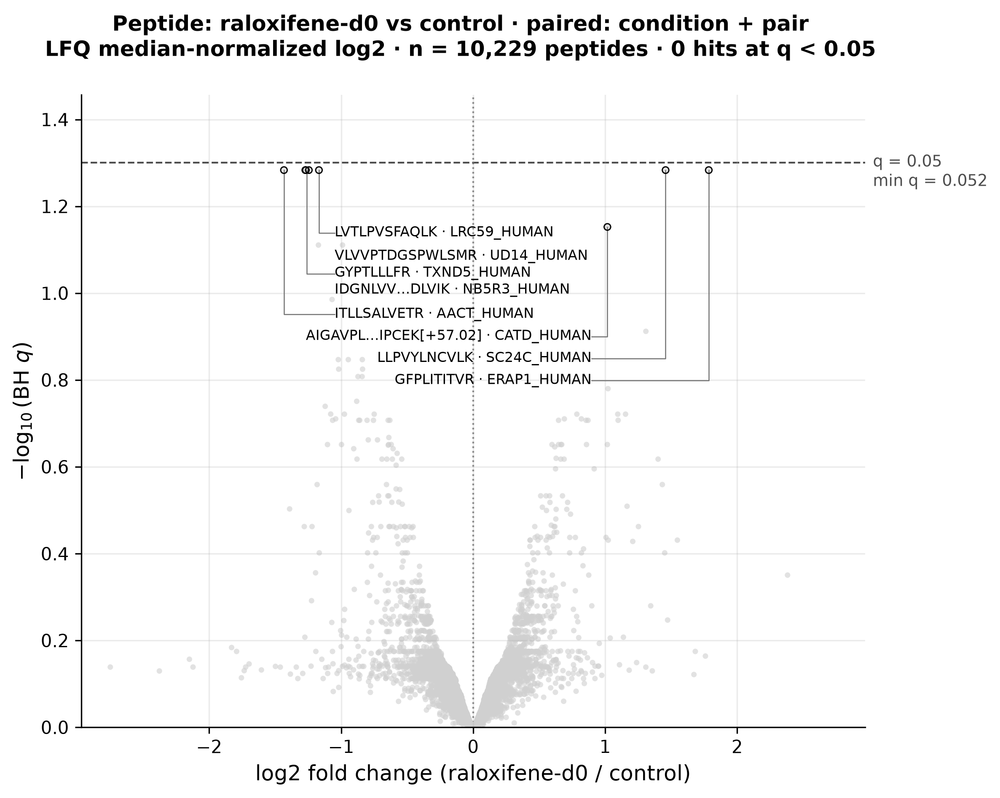

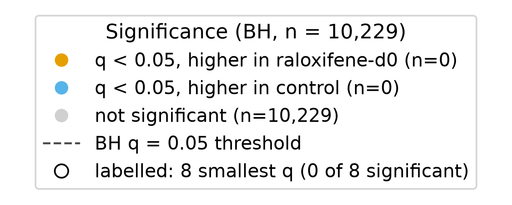

*Figure 2. LFQ peptide volcano, paired design. Produced by `scripts/scratch/fig_de_raloxifene_vs_control.py` (module `scripts/scratch/analysis_figures/volcano.py`, commit 416cb10) from `results/de/raloxifene-vs-control/peptide_paired.tsv`, data `sha256:bc6b73d3…1ba74`.*

A row of labelled peptides sits just under the dashed q = 0.05 line at −log10 q ≈ 1.28 (q 0.052): UD14, LRC59, AACT, NB5R3 and TXND5 on the left, SC24C and ERAP1 on the right. The CATD peptide sits slightly lower (q 0.070). These peptides have large effects (|log2FC| 1–1.8) and still do not cross the line. Figure 1 shows that the proteins they belong to do not stand out at protein level.

**Spectral-count quantities show the same null.** NSAF and log2 PSM counts give no hit at any threshold up to q < 0.10. The highest point on the NSAF volcano reaches only −log10 q ≈ 0.19, and on the PSM volcano ≈ 0.38.

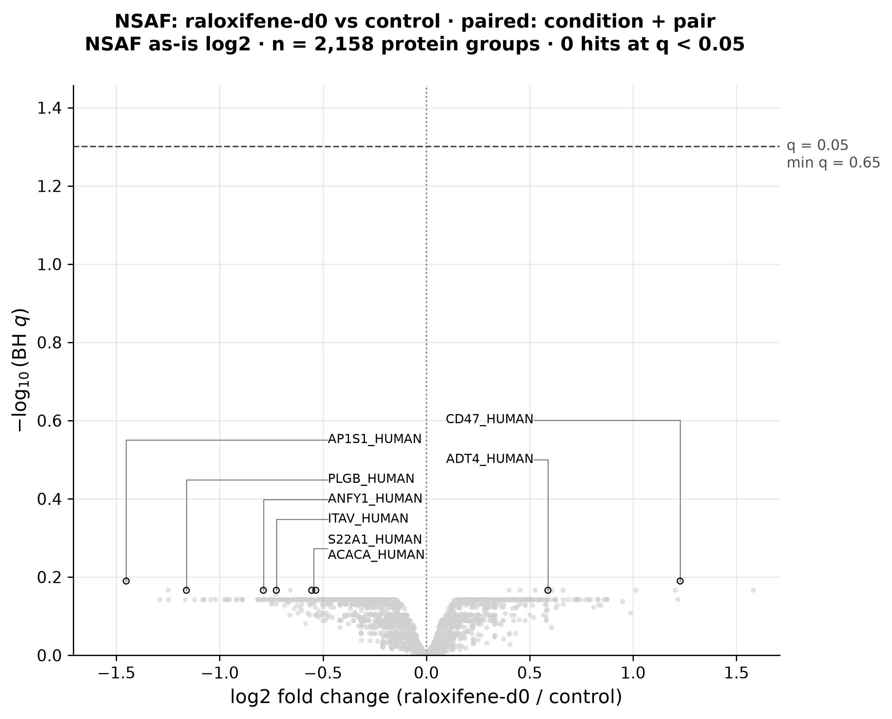

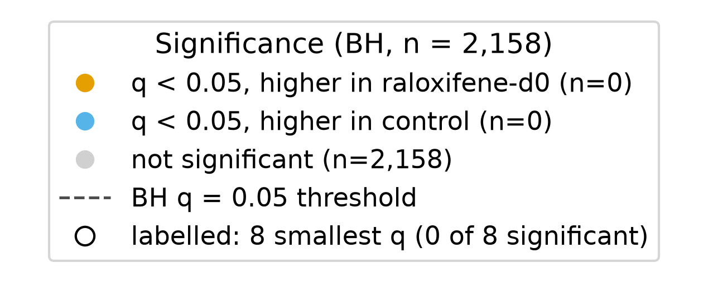

*Figure 3. NSAF volcano, paired design. Produced by `scripts/scratch/fig_de_raloxifene_vs_control.py` (module `scripts/scratch/analysis_figures/volcano.py`, commit 416cb10) from `results/de/raloxifene-vs-control/nsaf_paired.tsv`, data `sha256:bc6b73d3…1ba74`.*

The whole NSAF cloud is flattened near the x-axis (max −log10 q ≈ 0.19). Its labelled extremes (CD47 +1.23, AP1S1 −1.45) have q ≈ 0.65, so large spectral-count fold changes here carry almost no evidence.

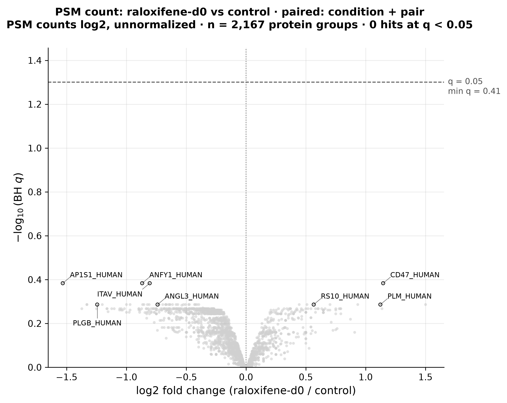

*Figure 4. log2 PSM-count volcano, paired design. Produced by `scripts/scratch/fig_de_raloxifene_vs_control.py` (module `scripts/scratch/analysis_figures/volcano.py`, commit 416cb10) from `results/de/raloxifene-vs-control/psm_log2_paired.tsv`, data `sha256:bc6b73d3…1ba74`.*

The PSM cloud tops out at −log10 q ≈ 0.38 (AP1S1, ANFY1, ITAV, CD47), far below the line. The left arm is denser and wider than the right, which shows the unnormalized downward shift (median log2FC −0.11, 27% positive) discussed under Caveats.

**Only the pair-blocked design is plausibly calibrated.** The log2FC estimates are identical across the three designs, because condition is balanced within pair and within batch. Only the SEs differ. Median protein residual SD is 0.14 in the paired design, 0.33 in the batch design and 0.42 in the unadjusted design. Paired π0 is 0.86 (protein), 0.87 (peptide), 0.83 (NSAF) and 0.76 (PSM), showing a broad excess of small p. In the batch and unadjusted designs, π0 is capped at 1.00 for every quantity (raw 1.17–1.67). These designs show a deficit near p = 0 and a hump near p = 1, meaning they are conservative: the pair variance stays in their residual.

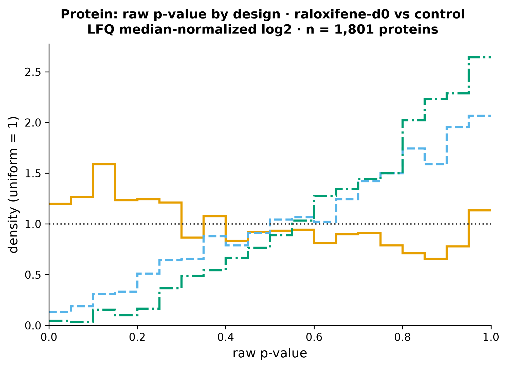

*Figure 5. LFQ protein p-value histograms by design. Produced by `scripts/scratch/fig_de_raloxifene_vs_control.py` (module `scripts/scratch/analysis_figures/pvalue_hist.py`, seeded pvalue-hist@0.2, commit 416cb10) from `results/de/raloxifene-vs-control/protein_{paired,batch,unadjusted}.tsv`, data `sha256:bc6b73d3…1ba74`.*

The solid orange paired curve stays near the dotted uniform line, a little above it for p < 0.3 (density 1.2–1.6) and a little below it above 0.5. The dashed blue batch curve and the dash-dot green unadjusted curve instead rise steadily from about 0.1 at p ≈ 0 to 2.1 and 2.6 at p ≈ 1. That shape is the signature of an inflated residual variance, which pushes p-values toward 1.

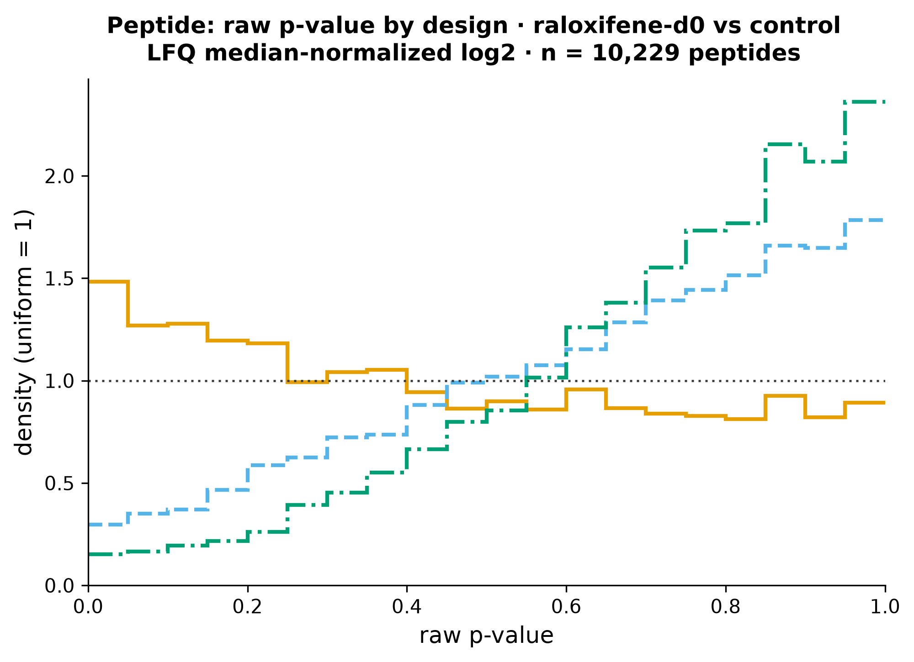

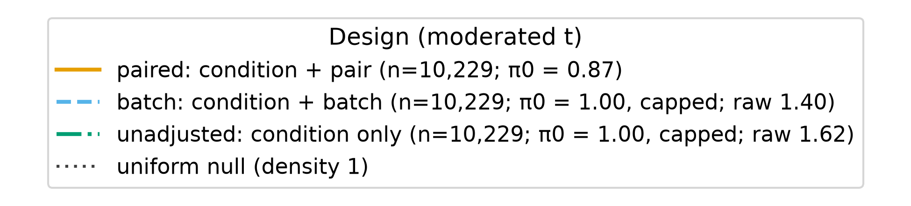

*Figure 6. LFQ peptide p-value histograms by design. Produced by `scripts/scratch/fig_de_raloxifene_vs_control.py` (module `scripts/scratch/analysis_figures/pvalue_hist.py`, commit 416cb10) from `results/de/raloxifene-vs-control/peptide_{paired,batch,unadjusted}.tsv`, data `sha256:bc6b73d3…1ba74`.*

The peptide level shows the same split. The paired curve (π0 0.87) is roughly flat with a mild rise at small p. The batch and unadjusted curves (raw π0 1.40 and 1.62) are depleted near 0 and piled up near 1.

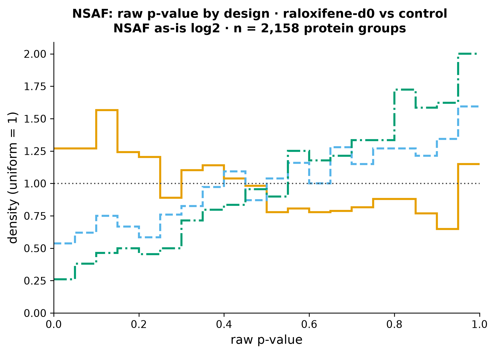

*Figure 7. NSAF p-value histograms by design. Produced by `scripts/scratch/fig_de_raloxifene_vs_control.py` (module `scripts/scratch/analysis_figures/pvalue_hist.py`, commit 416cb10) from `results/de/raloxifene-vs-control/nsaf_{paired,batch,unadjusted}.tsv`, data `sha256:bc6b73d3…1ba74`.*

For NSAF, the paired curve (π0 0.83) is near-uniform. The batch and unadjusted curves (raw π0 1.23 and 1.41) again rise toward p = 1, less steeply than for LFQ.

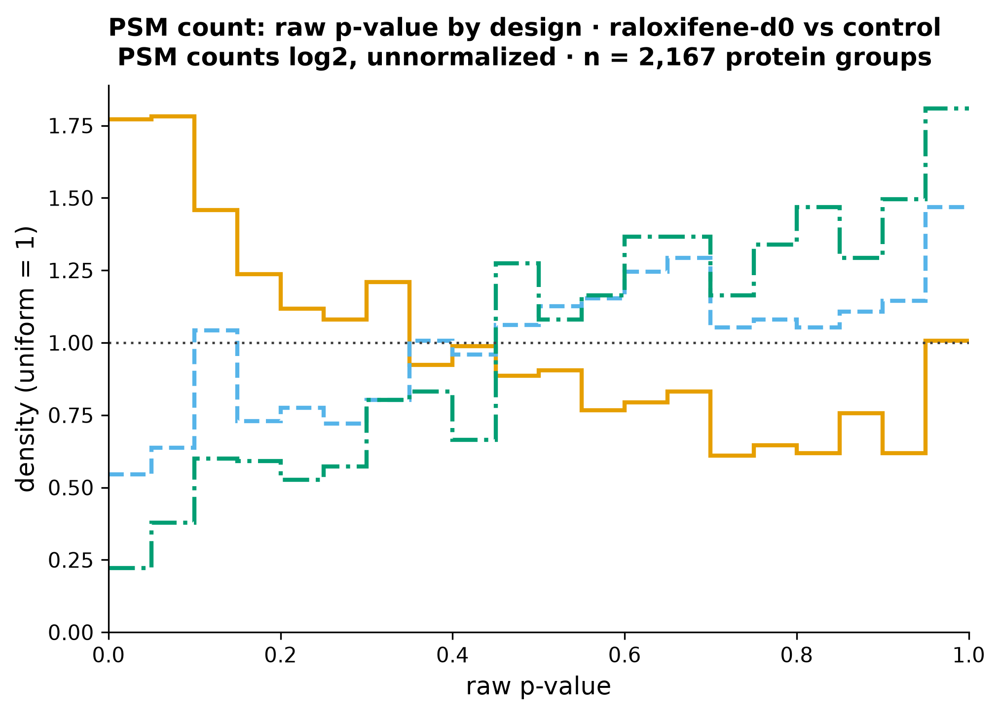

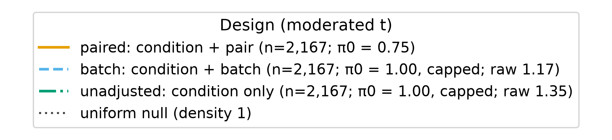

*Figure 8. log2 PSM-count p-value histograms by design. Produced by `scripts/scratch/fig_de_raloxifene_vs_control.py` (module `scripts/scratch/analysis_figures/pvalue_hist.py`, commit 416cb10) from `results/de/raloxifene-vs-control/psm_log2_{paired,batch,unadjusted}.tsv`, data `sha256:bc6b73d3…1ba74`.*

For PSM counts, the paired curve has the strongest small-p excess of any quantity (π0 0.76). The batch and unadjusted curves (raw π0 1.17 and 1.35) are the least conservative of the four quantities, but they are still depleted at small p.

**The paired small-p excess appears in every quantity and is largest for unnormalized PSM counts.**

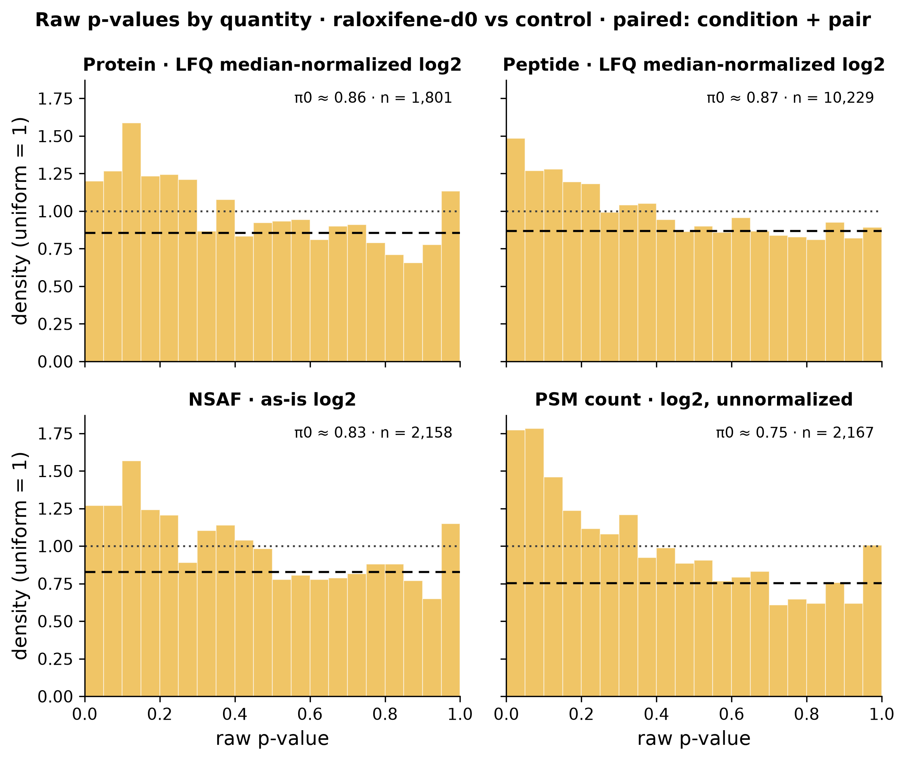

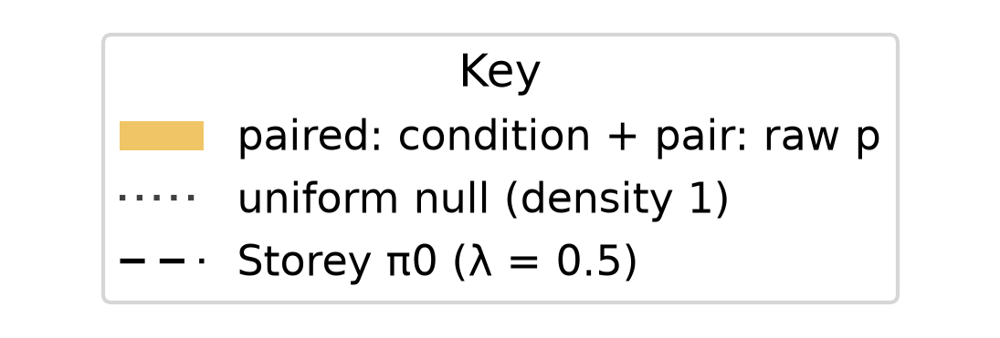

*Figure 9. Paired-design p-value histograms, one panel per quantity. Produced by `scripts/scratch/fig_de_raloxifene_vs_control.py` (module `scripts/scratch/analysis_figures/pvalue_hist.py`, commit 416cb10) from `results/de/raloxifene-vs-control/{protein,peptide,nsaf,psm_log2}_paired.tsv`, data `sha256:bc6b73d3…1ba74`.*

In each panel the bars for p < 0.25 stand above the dotted uniform line, and the rest sit near the dashed π0 level: protein 0.86, peptide 0.87, NSAF 0.83, PSM 0.75. The PSM panel is the most skewed (first bins ≈ 1.75). Caveat 6 below shows that this skew is largely caused by the missing normalization. No panel has the sharp spike at p ≈ 0 that a set of strong true effects would produce.

## Methods / how to produce
Run `scripts/scratch/de_raloxifene_vs_control.py` (module `scripts/scratch/analysis/differential_abundance.py`, seeded from `differential-abundance@0.1`, with the limma `fitFDist` zero-variance floor added) at commit 416cb10 on data `sha256:bc6b73d30e40d6ec190f8cd4494ec58d984a475f670d5aab5d8b238974d1ba74`. The environment is `pyproject.toml` + `uv.lock` on Python 3.12.3. The sample set is all 8 experimental runs; there are no QC or pool controls. The contrast is raloxifene-d0 vs control, with positive log2FC meaning higher in raloxifene-d0. The method is a limma-style linear model with empirical-Bayes moderation (single prior, no trend). BH correction is applied per quantity × design, and CIs are 95% t intervals on the moderated SE. The designs are paired (condition + candidate_pair, primary), condition + batch, and condition only. Inputs are the complete-feature LFQ protein and peptide states (median-normalized log2), log2 NSAF as exported, and log2 PSM counts (unnormalized). Constant features were dropped, and there is no imputation. Outputs are `results/de/raloxifene-vs-control/summary.json`, `<quantity>_<design>.tsv` and `results/<quantity>_<design>/`. Figures come from `scripts/scratch/fig_de_raloxifene_vs_control.py` (provenance sidecar `results/de/raloxifene-vs-control/figure_provenance.json`). The statistical review passed, and all 12 fits match R limma 3.58.1 to about 1e-13.

## Discussion
The result matches the Stage-0 near-null expectation (`state/PROJECT.md`): an in vitro microsome incubation is not expected to change protein abundance substantially, and a well-calibrated pipeline should report few or no confident hits. That agreement is itself a risk. Per the project's motivated-reasoning note, the expectation must not be used to dismiss the lean in the data. The paired p-values do show a small-p excess, the peptide level has 10 near-threshold features with large effects, and a trend-aware model would call some of them. These are recorded here as open questions, not explained away. The evidence available now (relabelling rank, the abundance-tercile pattern of π0, and run-order aliasing) points toward a technical source. It does not rule out a small real effect.

The design comparison is the more solid result. Blocking on pair removes most residual variance (median protein residual SD 0.14 vs 0.33 and 0.42), and only then does the p-value distribution look near-uniform. The batch and unadjusted fits are misspecified, and their conservatism is what one would expect from leaving a large shared-pair component in the residual. These statements about blocking and calibration are general statistical background and do not yet have citations.

## Caveats
1. **Exploratory, minimal design.** There are 4 pairs and residual df 3. Pairing is inferred from consecutive sample IDs, strongly supported by [finding 0003](0003-samples-structured-by-matched-pairs.md) but not recorded in metadata. Only complete features were tested, with no imputation, so proteins that are present in one condition and absent in the other were not tested.
2. **Run order is aliased with condition in every pair** ([finding 0001](0001-run-order-aliased-with-condition.md)). Any small-p excess, and any future hit, could reflect condition or run order (drift).
3. **"No protein hits" depends on the model.** The primary model has no mean-variance trend, although residual SD falls with abundance (Spearman ρ −0.48, protein). Under limma-trend (paired), ATPK becomes q = 0.039 and 10 peptides reach q < 0.05.
4. **Do not read π0 as "~14% of proteins change".** The within-pair relabelling diagnostic ranks the observed labelling 1/8 (protein, NSAF, PSM) and 2/8 (peptide). With 8 labellings the smallest attainable p is 0.125, so the observed excess cannot be distinguished from relabelling at this design's resolution. The excess is concentrated in low-intensity proteins (π0 by abundance tercile, low/mid/high: 0.77/0.88/0.93), which points to a technical source such as drift, the detection floor or an unmodelled trend.
5. **The batch and unadjusted designs are misspecified sensitivity runs, not corroboration.** Their agreement with the paired null carries no extra weight, because they are conservative by construction here.
6. **PSM results reflect the lack of normalization.** Median PSM log2FC is −0.11, and only 27% of fold changes are positive. Median-normalizing PSM counts moves π0 from 0.755 to 0.893, so much of the PSM small-p excess is a global offset.
7. **Multiplicity context** (`findings/exploration-log.md`, 2026-09-23 entry). This finding covers 4 quantities × 3 designs = 12 analyses, plus a common-set comparison ([finding 0005](0005-lfq-more-precise-than-spectral-counts.md)) and the unrequested within-pair relabelling diagnostic. BH is applied within each quantity × design, not across the 12. The exploration log also records a post-hoc look at CYP3A4 (log2FC −0.24 [−0.53, +0.06], p 0.096), which is context only and not part of this claim.
8. **Entity note.** The CATD peptide's protein-group string in the export lacks an accession (`sp|CATD_HUMAN|`). The UniProt accession P07339 in `entities` was assigned from the entry name, not read from the data.

## Follow-ups
- Run a limma-trend sensitivity analysis (paired) and report whether ATPK and the 10 peptides hold up, alongside a relabelling check of the trend model.
- ATPK: check whether the LFQ direction (−0.52) disagrees with the spectral-count direction, and whether its peptides agree.
- Compare the median-normalized PSM results against the unnormalized PSM results reported here.
- Ask the scientist whether pair identity (shared microsome source/prep) can be confirmed from lab records.

## Related findings
- [Finding 0003 (samples structured by matched pairs)](0003-samples-structured-by-matched-pairs.md) — `relates_to`. The primary paired design follows its recommendation, and the calibration contrast between designs confirms that pair is the dominant variance component.
- [Finding 0001 (run order aliased with condition)](0001-run-order-aliased-with-condition.md) — `relates_to`. The control was run first in every pair, so every within-pair contrast here is also a run-order contrast.
- [Finding 0002 (unequal two-batch structure)](0002-two-acquisition-batches-6-vs-2.md) — `relates_to`. The condition + batch model is one of the sensitivity designs. Batch is nested in pair, and the batch model is conservative.
- [Finding 0005 (LFQ precision vs spectral counts)](0005-lfq-more-precise-than-spectral-counts.md) — its precision comparison uses these same paired fits on the common protein set. The edge is recorded in 0005 (`0005 relates_to 0004`).

## References
None yet. Software: R limma 3.58.1 was used as the numerical reference for the stats review. The statements on blocking and p-value calibration are general statistical background and do not yet have citations.
