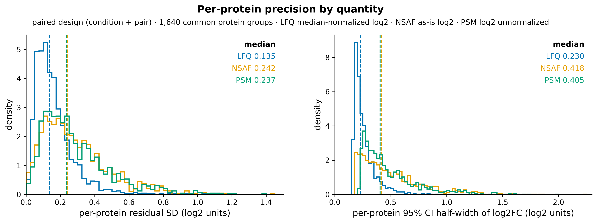
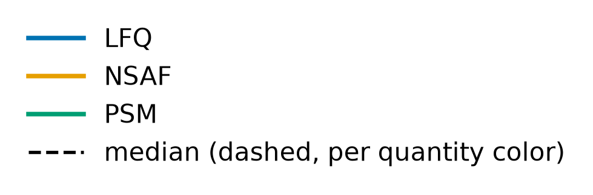
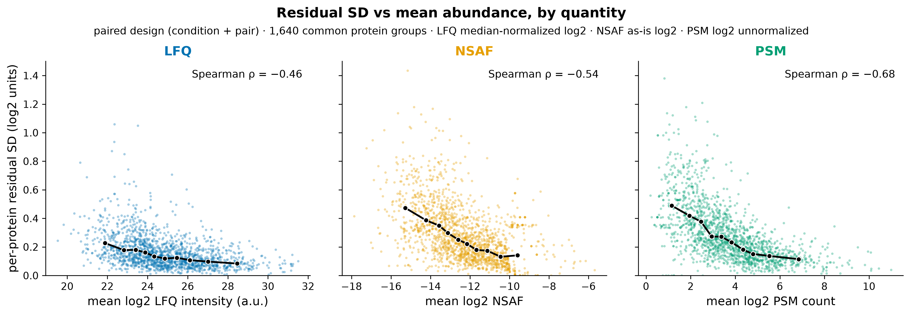
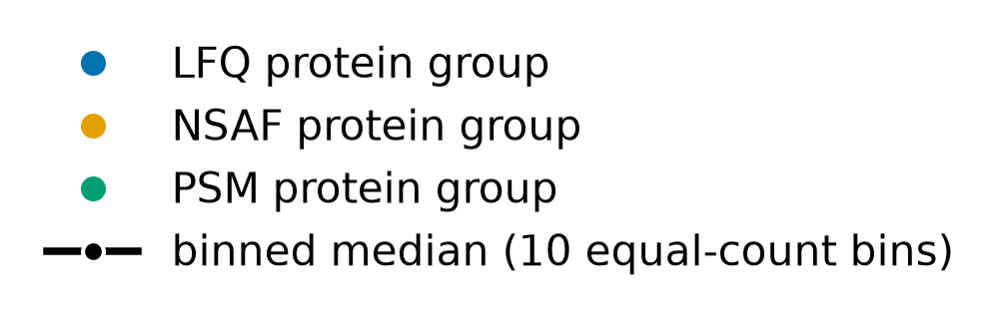
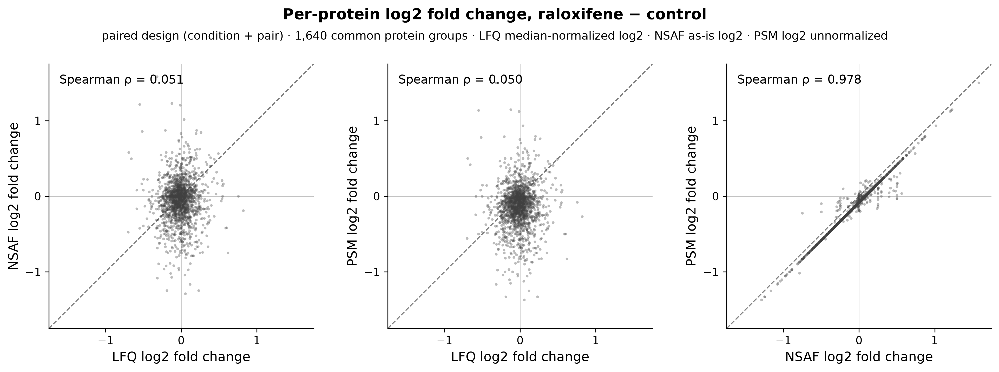
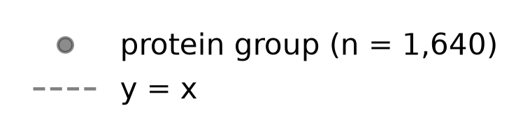

# LFQ intensities are ~1.8x more precise per protein than NSAF or PSM counts, and their per-protein fold changes do not agree with spectral counts under this near-null

## Summary
The comparison uses the 1,640 protein groups quantified completely by LFQ, NSAF and PSM counts, all analysed with the same paired design and residual df 3. On these proteins, LFQ has a median per-protein residual SD of 0.135 log2, compared with 0.242 for NSAF and 0.237 for PSM, about 1.8× lower. LFQ is lower at every abundance level. Per-protein fold changes barely correlate between LFQ and the spectral quantities (ρ ≈ 0.05), while NSAF and PSM track each other almost perfectly (ρ 0.98).

## Verdict
This is an exploratory methods finding, recorded as a candidate. In log2 units, LFQ intensities give tighter within-pair replicate agreement and narrower fold-change CIs than spectral counts on the same proteins and design. That is real evidence for LFQ's precision advantage in this dataset. It is not evidence of greater power to detect true change, because there is no ground truth here and fold-change compression may differ between MS1 intensity and counts. The low LFQ-to-spectral fold-change concordance is what a near-null would produce, and it does not show that the methods disagree.

## Evidence

**Per-protein precision: LFQ is about 1.8× tighter than either spectral quantity.** On the 1,640 common protein groups, the median unmoderated residual SD (the fair like-for-like measure, df 3 for all) is LFQ 0.135, NSAF 0.242 and PSM 0.237. The median 95% CI half-width of log2FC is 0.230, 0.418 and 0.405. The half-width also depends on the empirical-Bayes prior df d0 (LFQ 3.19, NSAF 1.41, PSM 1.91), because quantization lowers the spectral d0. The ordering is the same on either measure.

*Figure 1. Residual SD and CI half-width distributions by quantity. Produced by `scripts/scratch/fig_quant_comparison.py` (module `scripts/scratch/analysis_figures/quant_comparison.py`, commit 416cb10) from `results/de/raloxifene-vs-control/common_set_comparison.tsv`, data `sha256:bc6b73d3…1ba74`; sidecar `results/de/raloxifene-vs-control/quant_comparison_figure_provenance.json`.*

In the left panel, the blue LFQ distribution is concentrated at 0.05–0.2, with its median line at 0.135. The orange NSAF and green PSM distributions nearly coincide, are broader, and have heavy right tails that reach past 0.6. Their median lines sit together near 0.24. The right panel shows the same separation in CI half-width: LFQ piles up at about 0.2, while NSAF and PSM spread from 0.2 to beyond 1.

**LFQ is more precise at every abundance, and most of all for low-abundance proteins.** Residual SD falls with abundance for all three quantities (Spearman ρ LFQ −0.46, NSAF −0.54, PSM −0.68). From the lowest to the highest abundance decile, the binned median SD goes from 0.228 to 0.084 for LFQ, from 0.474 to 0.141 for NSAF and from 0.490 to 0.115 for PSM.

*Figure 2. Residual SD vs abundance by quantity. Produced by `scripts/scratch/fig_quant_comparison.py` (module `scripts/scratch/analysis_figures/quant_comparison.py`, commit 416cb10) from `results/de/raloxifene-vs-control/common_set_comparison.tsv` joined to `<quantity>_paired.tsv` mean abundance, data `sha256:bc6b73d3…1ba74`.*

Compare the black binned-median lines across the three panels, which share a y-axis. The LFQ line starts at about 0.23 and flattens to 0.08. The NSAF and PSM lines start about twice as high (≈ 0.47–0.49) and fall steeply, but they stay above LFQ at every bin (≈ 0.12–0.14 at the top). The gap is widest at the low-abundance end, where spectral counts are small integers.

**Per-protein fold changes: LFQ and spectral counts are nearly uncorrelated, and NSAF and PSM are nearly identical.** The Spearman correlation of paired log2FC is 0.051 for LFQ–NSAF, 0.050 for LFQ–PSM and 0.978 for NSAF–PSM. On moderated t, the values are 0.063, 0.082 and 0.964. Among proteins with ≥ 20 mean PSMs, where count noise is lowest, the LFQ–spectral ρ rises only to 0.16.

*Figure 3. log2FC concordance between quantities. Produced by `scripts/scratch/fig_quant_comparison.py` (module `scripts/scratch/analysis_figures/quant_comparison.py`, commit 416cb10) from `results/de/raloxifene-vs-control/common_set_comparison.tsv`, data `sha256:bc6b73d3…1ba74`.*

In the two LFQ panels the cloud is a round blob centered at the origin, with no tilt along the dashed y = x line. The spread is narrow along the LFQ axis (about ±0.5) and wider along the spectral axis (about ±1), which is the precision difference of Figure 1 seen from another angle. In the NSAF-vs-PSM panel the points lie on a tight line parallel to y = x, offset slightly below it. That offset is the unnormalized-PSM shift (median PSM log2FC −0.11, [finding 0004](0004-no-differential-abundance-raloxifene-vs-control.md)).

## Methods / how to produce
The per-protein fits are the paired-design (condition + candidate_pair) moderated fits of `scripts/scratch/de_raloxifene_vs_control.py` (module `scripts/scratch/analysis/differential_abundance.py`, seeded from `differential-abundance@0.1`, with the limma `fitFDist` zero-variance floor), at commit 416cb10 on data `sha256:bc6b73d30e40d6ec190f8cd4494ec58d984a475f670d5aab5d8b238974d1ba74`. The environment is `pyproject.toml` + `uv.lock` on Python 3.12.3, and the sample set is all 8 experimental runs. The common-set table `results/de/raloxifene-vs-control/common_set_comparison.tsv` joins the 1,640 protein groups complete in LFQ protein (median-normalized log2), NSAF (log2, as exported) and PSM (log2, unnormalized). A design check confirms its log2FC and residual SD equal the `<quantity>_paired.tsv` values exactly. Residual SD is the per-feature unmoderated OLS residual SD (df 3). CI half-width is (ci_high − ci_low)/2 of the 95% t interval on the moderated SE. Abundance trends use 10 equal-count bins of mean log2 abundance. Figures come from `scripts/scratch/fig_quant_comparison.py` (module `scripts/scratch/analysis_figures/quant_comparison.py`). The stats review of the underlying fits passed, and all fits match R limma 3.58.1 to about 1e-13.

## Discussion
This finding serves the scientist's stated goal of demonstrating the value of LFQ approaches (`state/PROJECT.md`). The support it gives is specific. On identical proteins, samples and design, LFQ intensities vary less between replicates of the same pair than spectral counts do, by roughly a factor of 1.8 in median residual SD, and the advantage is largest for low-abundance proteins where counts are sparse. Narrower per-protein CIs follow from this. The finding does **not** show that LFQ would detect more true changes. That depends on how each quantity compresses or expands real fold changes, and this near-null dataset has no known changes to calibrate against. A spike-in or known-difference dataset would be needed to make a power claim. The near-zero fold-change concordance should also not be presented as "LFQ and spectral counting disagree." When there is little real difference, each quantity's per-protein fold change is mostly its own within-pair noise, and independent noise does not correlate. The quantities do agree on abundance level (mean-abundance Spearman LFQ vs PSM 0.89). These interpretive points are general measurement reasoning and do not yet have citations.

## Caveats
- **Precision in log2 units is not power to detect change.** Fold-change compression may differ between MS1 intensity and spectral counts, and there is no ground truth here.
- **Normalization differs by quantity.** LFQ is median-normalized, NSAF is total-normalized by construction, and PSM counts are unnormalized. These were the scientist's choices. The PSM offset (median log2FC −0.11) is a consequence.
- **NSAF export rounding.** The NSAF values were exported to 3 decimals for values ≥ 0.001. Ten constant NSAF groups were dropped, and 19 NSAF and 8 PSM features have an exactly-zero residual SD (quantization), which the fitFDist floor handles.
- **Count noise.** 22% of the common proteins average fewer than 5 PSMs.
- **No mean-variance trend in the prior.** Residual SD depends on abundance for all three quantities, so the moderated SEs (and CI half-widths) of a trend-free prior are miscalibrated across abundance. The unmoderated SD comparison does not depend on this.
- **The near-zero LFQ–spectral fold-change concordance is expected under a near-null** (independent within-pair noise). It does not show that the quantifications disagree.
- **NSAF vs PSM ρ 0.98 is near-tautological.** Protein length cancels in a per-protein log2FC, so NSAF and PSM are not two independent comparators. Effectively this is LFQ vs one spectral-count measure.
- **Exploratory and minimal:** 4 pairs, residual df 3, complete features only (the 1,640 groups present in all three quantities).
- **Run-order aliasing applies** ([finding 0001](0001-run-order-aliased-with-condition.md)). Within-pair noise includes any run-order drift, and drift could affect intensity and counts differently.
- **Multiplicity context** (`findings/exploration-log.md`, 2026-09-23 entry). The common-set comparison is one of the Stage-4 threads, alongside the 12 quantity × design analyses of [finding 0004](0004-no-differential-abundance-raloxifene-vs-control.md) and the relabelling diagnostic. No test is performed here, and the numbers are descriptive.

## Follow-ups
- Compare median-normalized PSM counts, to separate the normalization choice from the counting noise.
- Repeat the precision comparison under a limma-trend prior, or report binned SDs only.
- A power or compression claim would need a dataset with known differences (for example, a spike-in).
- Report the LFQ–spectral concordance restricted to proteins with nominal evidence in either quantity (for example ATPK, whose LFQ direction may disagree with the spectral direction), as flagged in 0004.

## Related findings
- [Finding 0004 (no differential abundance, raloxifene vs control)](0004-no-differential-abundance-raloxifene-vs-control.md) — `relates_to`. This comparison uses the same paired fits as 0004, restricted to the common protein set, and the near-null in 0004 is why the fold-change concordance is near zero.
- [Finding 0003 (samples structured by matched pairs)](0003-samples-structured-by-matched-pairs.md) — `relates_to`. The precision comparison is made in the pair-blocked design, so the residual SD measures within-pair noise.
- [Finding 0001 (run order aliased with condition)](0001-run-order-aliased-with-condition.md) — cited under Caveats for run-order aliasing. This is not a typed edge.

## References
None yet. Software: R limma 3.58.1 was used as the numerical reference for the stats review. The interpretive points on fold-change compression and noise concordance are general background and do not yet have citations.
