# Adding a mean-variance trend to the moderated prior yields at most one protein hit (ATPK) and 10 peptide hits, none distinguishable from within-pair relabelling

## Summary
The primary raloxifene-d0 vs control result (near-null; see [finding 0004](0004-no-differential-abundance-raloxifene-vs-control.md)) used a moderated-t model with a constant empirical-Bayes prior. Refitting all 4 quantities × 3 designs with a **mean-variance trend** in the prior (limma-trend, matched to R limma 3.58.1 to ~1e-12 on all 12 fits) changes the answer only for the pair-blocked LFQ fits: **1 protein hit** (ATPK, P56134, q 0.040) and **10 peptide hits** at q < 0.05 — exactly the 10 peptides that were q < 0.10 without a trend. NSAF, PSM counts, and every batch/unadjusted fit stay at 0 hits. None of these hits can beat the p = 1/8 floor of within-pair relabelling.

## Verdict
The trend prior is a **defensible model** — residual SD falls monotonically with abundance (Spearman −1.0), which is exactly the condition a trend is designed for — but it was chosen **after** ATPK was seen near the top of the no-trend ranking, and choosing it is what produces the hits. This is a post hoc model choice layered on the 12 quantity × design fits already run. The result stays effectively null: the observed labelling ranks best possible but cannot go below 1/8, and every hit is aliased with run order ([finding 0001](0001-run-order-aliased-with-condition.md)).

## Evidence

**A trend prior falls with abundance, and that is what lets high-abundance features become hits.** The empirical-Bayes prior SD, held constant at 0.137 in the primary model, becomes a curve falling 0.369 → 0.079 across the abundance range under a trend (d0 4.79 vs 3.01). It therefore inflates the SE of low-abundance proteins and shrinks it for high-abundance ones. ATPK — a high-abundance protein with a tiny residual SD (0.017) — is moderated toward a *smaller* prior SD (0.10) than the constant model would use, so its already-tight fold change becomes significant.

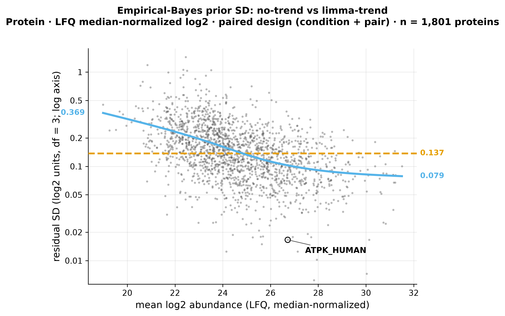

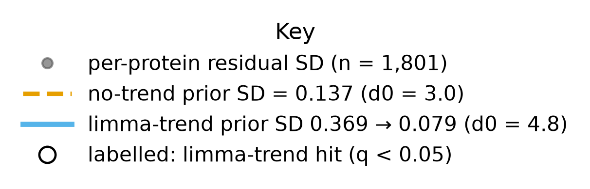

*Figure 1. Residual SD vs abundance with both priors. Produced by `scripts/scratch/fig_trend_atpk.py` (fc32cbc) from data `sha256:bc6b73d3…`.*

Each point is one protein at its mean abundance (x) and residual SD (y). The trend prior curve slopes down to the right while the no-trend prior is a flat line; ATPK sits far right with a residual SD well below both priors, so under the trend it is moderated toward a smaller variance and clears q < 0.05 — the mechanism, not a biological signal, is what makes it a hit.

**Only ATPK crosses the protein significance line under the trend.** Plotting the BH q with a trend against the q without one, per protein, shows the whole proteome hugging the diagonal except ATPK, which drops from q 0.21 (no trend) to q 0.040 (trend).

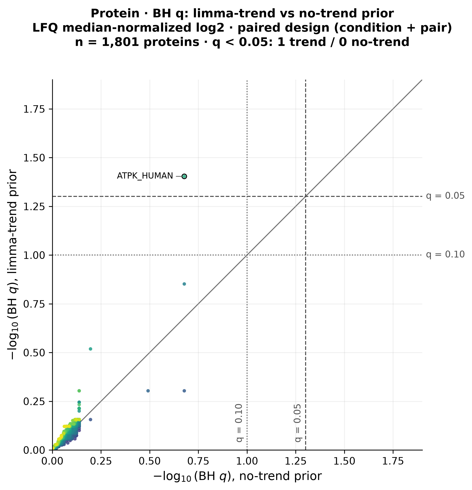

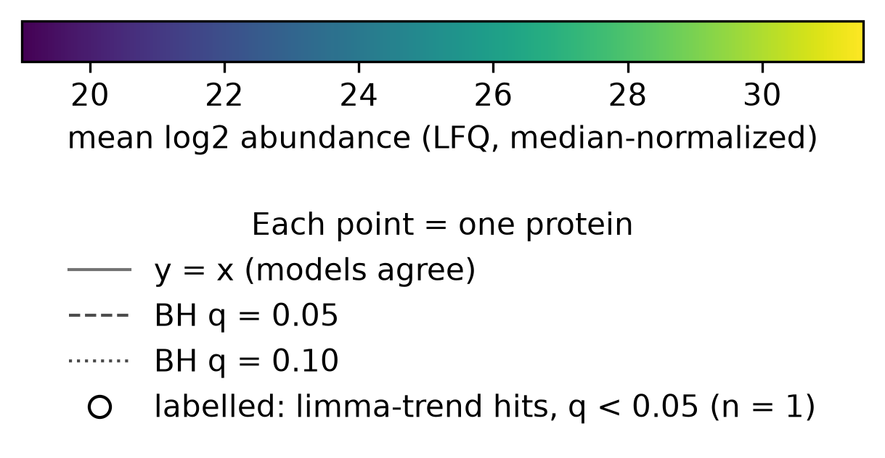

*Figure 2. Protein q, trend vs no-trend. Produced by `scripts/scratch/fig_trend_atpk.py` (fc32cbc) from data `sha256:bc6b73d3…`.*

Read the lower-left corner: a single high-abundance point (ATPK) sits left of the vertical q=0.05 line but above the horizontal one — significant with a trend, not without — while every other protein stays on the near-diagonal cloud above q=0.05 in both. One protein moving is the entire protein-level effect of the trend.

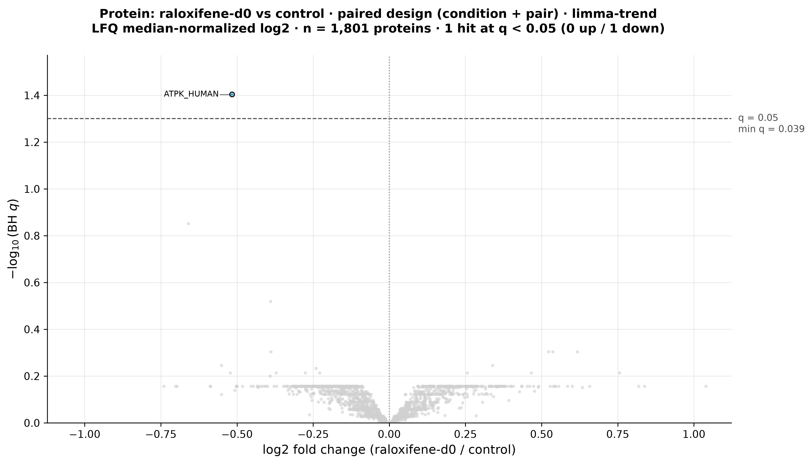

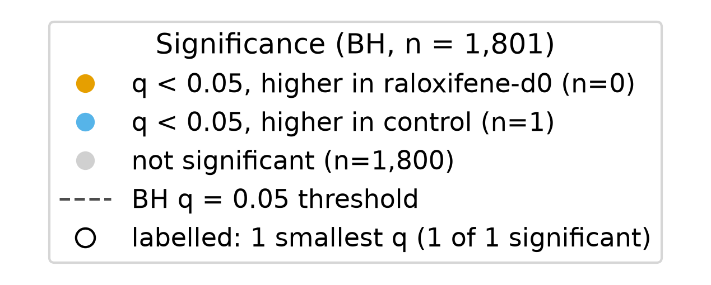

*Figure 3. Protein volcano, trend. Produced by `scripts/scratch/fig_trend_atpk.py` (fc32cbc) from data `sha256:bc6b73d3…`.*

The volcano confirms the count: a single labelled point (ATPK, log2FC −0.52) rises above the q=0.05 line, with the rest of the proteome in the gray cloud below — a one-protein result, not a coherent signature.

**The peptide hits are the no-trend borderline cases, promoted.** The 10 peptides that reach q < 0.05 with a trend are precisely the 10 that sat at q < 0.10 without one (no-trend q 0.052–0.077 → trend q 0.028–0.042); no-trend had 0 hits at q < 0.05.

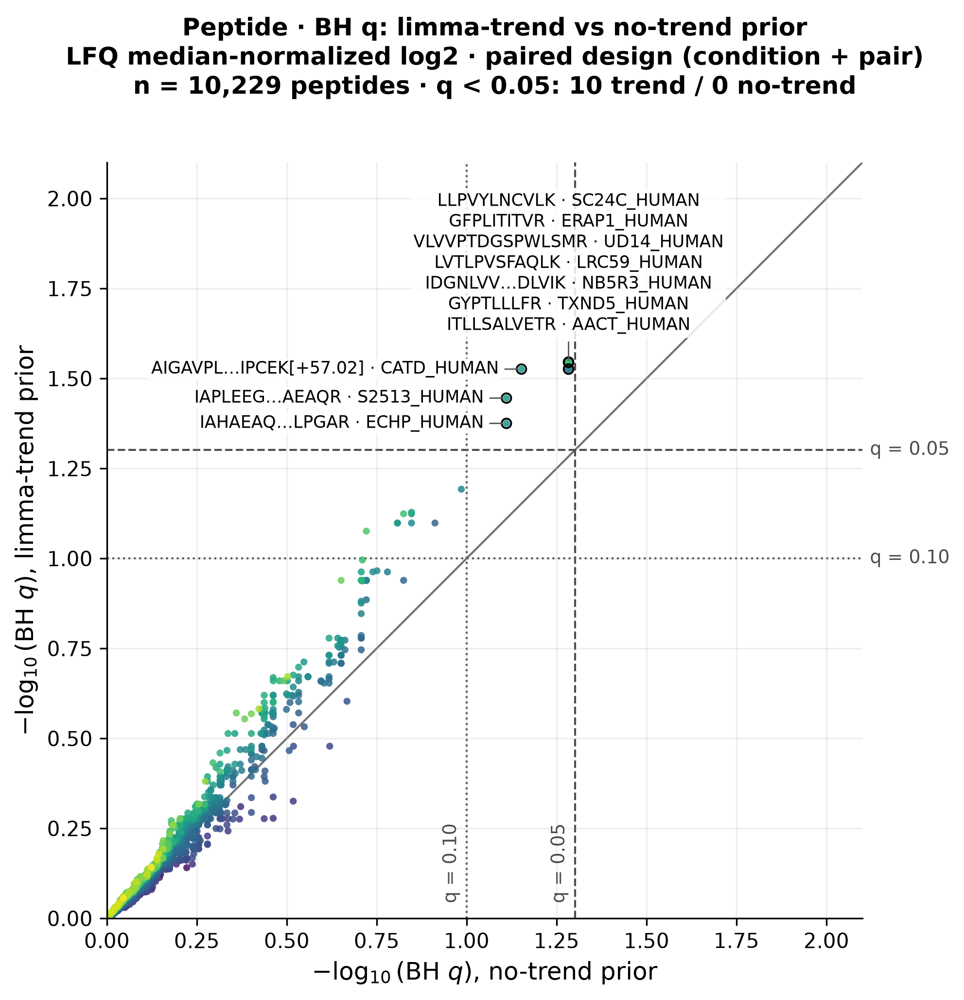

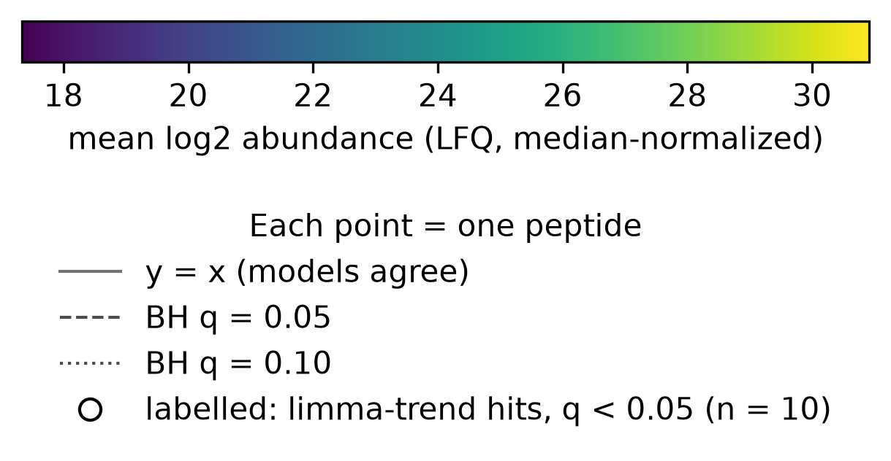

*Figure 4. Peptide q, trend vs no-trend. Produced by `scripts/scratch/fig_trend_atpk.py` (fc32cbc) from data `sha256:bc6b73d3…`.*

The points between the horizontal q=0.10 and vertical q=0.05 guide lines are the promoted set: they were just under 0.10 without a trend and just under 0.05 with it — a threshold nudge, not a new population of effects.

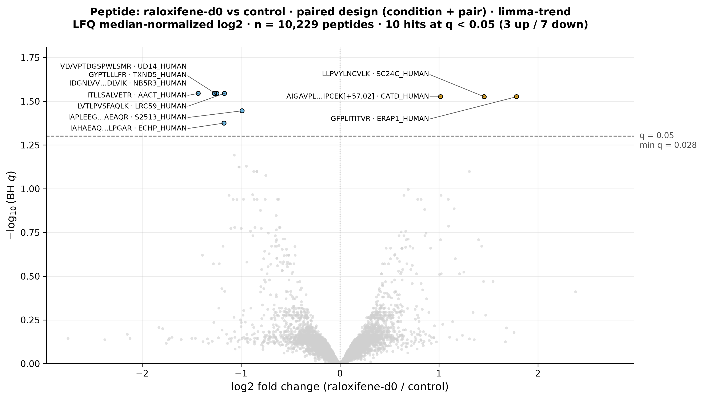

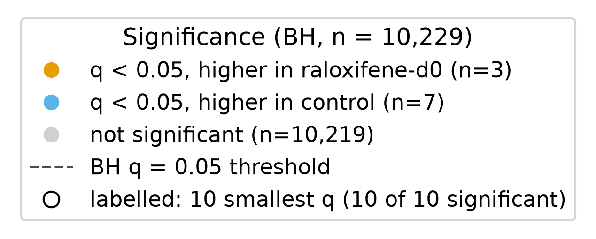

*Figure 5. Peptide volcano, trend. Produced by `scripts/scratch/fig_trend_atpk.py` (fc32cbc) from data `sha256:bc6b73d3…`.*

Ten labelled points (3 up, 7 down) clear the q=0.05 line; all are modest fold changes just past threshold, consistent with borderline cases being pushed over rather than a strong response emerging.

**None of the hits survives within-pair relabelling above the permutation floor.** With four matched pairs, there are 8 within-pair labellings (observed + 7 swaps), so the smallest attainable p is 1/8. The observed labelling produces the most hits for both protein (1; all 7 swaps give 0) and peptide (10; the 7 swaps give 0 or 1) and the lowest Storey π0 — but "ranks first of 8" is the best a permutation *can* do and still means p = 1/8. NSAF and PSM counts give 0 hits under every labelling.

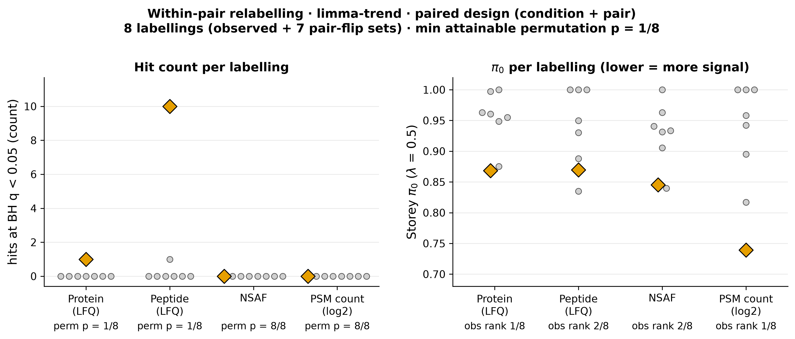

*Figure 6. Relabelling diagnostic, trend. Produced by `scripts/scratch/fig_trend_atpk.py` (fc32cbc) from data `sha256:bc6b73d3…`.*

For protein and peptide the orange (observed) bar is the tallest and every gray (relabelled) bar is at or near zero — the observed labelling is special, but with only 8 labellings the strongest statement possible is p = 1/8, above conventional α; for NSAF and PSM even the observed bar is zero.

## Methods / how to produce
Run `scripts/scratch/de_trend_sensitivity.py` (commit fc32cbc) with module `scripts/scratch/analysis/differential_abundance.py` (`method='moderated', trend=True`, seeded from `differential-abundance@0.1` with limma-trend added), on data version `sha256:bc6b73d3…`, environment `pyproject.toml + uv.lock` (Python 3.12.3). All 4 quantities × 3 designs are refit with `eBayes(trend=TRUE)` (prior variance = natural cubic spline, 4 df, of mean log2 abundance fitted to log residual variances); BH per quantity × design over the contrast term; Storey π0 at λ=0.5; the 8 within-pair labelling diagnostic. Fits match R limma 3.58.1 `lmFit + eBayes(trend=TRUE)` to ~1e-12 across all 12 fits (`r_agreement.json`). Figures from `scripts/scratch/fig_trend_atpk.py` (module `scripts/scratch/analysis_figures/trend_atpk.py`). Outputs under `results/de/raloxifene-vs-control/trend/`.

## Discussion
The finding is a near-null framing. A mean-variance trend is a legitimate *a priori* modelling choice — residual variance does fall with abundance here, which is the assumption the trend encodes — but its adoption in this analysis was outcome-driven: it was tried after ATPK was near the top under the plain model. That the "significant" set is one high-abundance protein and ten borderline peptides, all confined to the single pair-blocked LFQ design and none able to clear the relabelling floor, is what keeps the honest conclusion at "no differential abundance." The lesson is about model degrees of freedom under a small n, not about biology: with four pairs the choice between two defensible priors flips the headline count between 0 and 11.

## Caveats
- **Exploratory.** Four pairs, residual df 3. Effects are derived on the same data they were observed in; the forking-paths risk is not retired.
- **The trend model was chosen post hoc**, after ATPK was seen near the top of the no-trend ranking. This is multiplicity on top of the 12 quantity × design fits already run (see the exploration log, 2026-09-24).
- **Run order is aliased with condition** ([finding 0001](0001-run-order-aliased-with-condition.md)): every control ran before its raloxifene-d0 partner, so any hit is condition **or** run order and the two cannot be separated.
- **The 1/8 permutation floor** means no hit here is distinguishable from within-pair relabelling at conventional α; "ranks 1/8" is the best a four-pair permutation can produce.
- **The trend prior is defensible but decisive**: residual SD falls with abundance (Spearman −1.0), so a trend is reasonable — but adopting it, rather than any signal in the data, changes the answer from 0 hits to 11.
- The calibration is unchanged in kind from the primary model: the paired fits still show a small-p excess concentrated at low abundance (see [finding 0004](0004-no-differential-abundance-raloxifene-vs-control.md)).

## Follow-ups
- The ATPK protein hit's LFQ-vs-spectral direction disagreement was pursued as a case study (see Related findings).
- If the trend model is to be reported at all, pre-specify it before analysis on a held-out or orthogonal dataset (confirmatory phase) rather than adopting it after seeing the ranking.

## Related findings
- Refines [finding 0004](0004-no-differential-abundance-raloxifene-vs-control.md): 0004 established the near-null result under a constant prior; this finding shows a trend prior surfaces a handful of hits that still fail the relabelling floor, so the near-null verdict stands.
- Relates to [finding 0001](0001-run-order-aliased-with-condition.md): run order is aliased with condition, so every hit here is condition or run order.
- Relates to [finding 0003](0003-samples-structured-by-matched-pairs.md): the hits appear only in the pair-blocked design, the matched-pair structure documented there.

## References
None.
