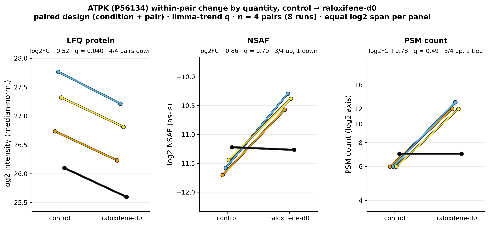
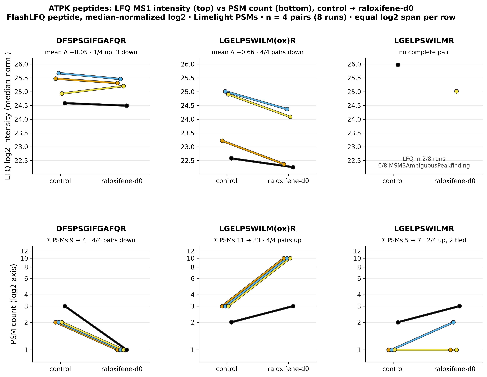
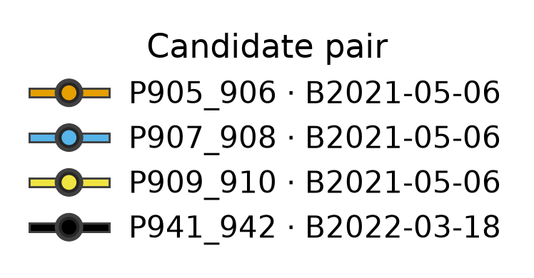

# ATPK's LFQ-vs-spectral direction disagreement is an artifact of one Met-oxidized peptide, not a protein abundance change

## Summary
ATPK (P56134, gene ATP5MF) is the single protein hit surfaced by the trend model ([finding 0006](0006-limma-trend-sensitivity.md)), and its direction depends on the quantity: LFQ says **down** (log2FC −0.52, 4/4 pairs) while NSAF (+0.86) and PSM counts (+0.78) say **up**. Dissecting it peptide by peptide shows the spectral "increase" is one **Met-oxidized peptide** (LGELPSWILM(ox)R) gaining +22 PSMs (11 → 33) while its **MS1 intensity falls** in all four pairs. A single species whose count and intensity contradict is not a coherent abundance change.

## Verdict
The disagreement is a peptide-level artifact, not a biological direction conflict. The count-based "up" is driven entirely by more PSMs landing on an oxidized form whose measured intensity is going down; the LFQ "down" partly rests on protein-level signal that is not reconstructable from the reported peptide table. Because run order is aliased with condition, even the artifact's likely cause (queue-dependent oxidation or chromatography) cannot be tested here.

## Evidence

**The three quantities disagree in direction, per pair.** LFQ protein is down in all four pairs and tight (−0.50 to −0.55, mean −0.52, SD 0.024); NSAF is up in 3 of 4 (mean +0.86, one pair −0.05); PSM counts are up in 3 of 4 (6→12, 6→13, 6→12, 7→7; mean +0.78). Neither spectral quantity is significant (NSAF q 0.70, PSM q 0.49), and with a per-run mean of ~8.6 PSMs, Poisson noise alone gives a per-pair log2-ratio SD of ~0.72 — the count "signal" is barely above sampling noise.

*Figure 1. ATPK per-pair change by quantity. Produced by `scripts/scratch/fig_trend_atpk.py` (fc32cbc) from data `sha256:bc6b73d3…`.*

Read across the three columns: the LFQ points all sit below zero and tightly clustered, while the NSAF and PSM points sit mostly above zero and scattered. The same protein moves down by one measure and up by two — the signature of a quantity-dependent artifact rather than a real abundance shift.

**The spectral increase is one oxidized peptide whose intensity is falling.** ATPK has three LFQ peptides and no match-between-runs. The unmodified DFSPSGIFGAFQR (MSMS 8/8) is flat in MS1 (mean −0.05) and its PSMs *fall* 9→4. The Met-oxidized LGELPSWILM(ox)R (MSMS 8/8) has MS1 intensity **down in all four pairs** (mean −0.66) yet its PSMs **rise 11→33** (up 4/4). The unmodified LGELPSWILMR is MSMSAmbiguousPeakfinding in 6 of 8 runs and never forms a complete pair. So the whole spectral-count "up" for ATPK is +22 PSMs concentrated on the oxidized peptide (all other ATPK peptides together lose 3), while that peptide's intensity goes down.

*Figure 2. ATPK peptide MS1 vs PSM count. Produced by `scripts/scratch/fig_trend_atpk.py` (fc32cbc) from data `sha256:bc6b73d3…`.*

The oxidized peptide is the point where the intensity axis is strongly negative but the count axis is strongly positive — count and intensity pointing opposite ways for one species. That contradiction is exactly what a coherent abundance change would not produce, and it is the whole of the spectral-count "increase."

**The LFQ decrease itself is not fully reconstructable from the peptide table.** FlashLFQ's protein intensity is not the sum of the reported unique peptide intensities — the protein/peptide-sum ratio ranges 0.77–2.57 across the eight runs, and across all proteins only ~11% of protein×run cells equal their peptide sum. So the −0.52 rests in part on signal not visible in the peptide table (e.g. the ambiguous unmodified LGELPSWILMR, reported with zero intensity there).

## Methods / how to produce
Run `scripts/scratch/atpk_case_study.py` (commit fc32cbc) on data version `sha256:bc6b73d3…`, environment `pyproject.toml + uv.lock` (Python 3.12.3). The DE fold changes are read from the trend sensitivity tables (`results/de/raloxifene-vs-control/trend/`); the peptide MS1, detection types, MBR flags, and per-peptide PSMs (control vs raloxifene) come from the FlashLFQ peptide table and the Limelight PSM dump for protein group `psvid_86283_sp|P56134|ATPK_HUMAN`. Differences are raloxifene-d0 minus control within `candidate_pair`. Outputs: `atpk_case.json`, `atpk_case_pairs.tsv`, `atpk_case_samples.tsv`. Figures from `scripts/scratch/fig_trend_atpk.py` (module `scripts/scratch/analysis_figures/trend_atpk.py`).

## Discussion
This is a caution for spectral-count differential analysis: a **modified-peptide PSM gain can masquerade as protein up-regulation**. Here more PSMs are assigned to an oxidized form of one ATPK peptide, which raises NSAF and PSM counts for the protein, even as the actual MS1 signal for that form declines. Because MS1 intensity and spectral counts are different observables — one measures ion current, the other identification events — they can diverge for a single peptide, and a count-only pipeline would have called ATPK up. The worked case explains, at the peptide level, the dataset-wide LFQ-vs-spectral discordance reported in [finding 0005](0005-lfq-more-precise-than-spectral-counts.md).

## Caveats
- **Exploratory.** Four pairs; the 2022 pair (P941_942) is a different acquisition batch ([finding 0002](0002-two-acquisition-batches-6-vs-2.md)). Descriptive; no test beyond the existing DE tables.
- **ATPK was examined because it was the top hit** ([finding 0006](0006-limma-trend-sensitivity.md)), so its effect size is selection-optimistic.
- **The count/intensity divergence has a plausible, untested technical explanation.** Run order is aliased with condition ([finding 0001](0001-run-order-aliased-with-condition.md)), so a queue-dependent process — Met oxidation increasing along the run order, or chromatographic drift — is a candidate cause that cannot be separated from treatment here.
- **MS1 intensity and spectral counts are different observables**; their divergence for one peptide is informative but is not itself a controlled comparison.
- Dump intensities are display-rounded (3 s.f.); PSM counts are exact integers.

## Follow-ups
- Test the oxidation-along-queue hypothesis directly with a design that breaks the run-order/condition alias (randomized or interleaved acquisition).
- Consider whether the contaminant/ambiguous-peptide handling (see the exploration log, 2026-09-24) affects the FlashLFQ roll-up for ATPK.

## Related findings
- Relates to [finding 0006](0006-limma-trend-sensitivity.md): ATPK is the single protein hit the trend model surfaces; this finding explains why its direction disagrees across quantities.
- Relates to [finding 0005](0005-lfq-more-precise-than-spectral-counts.md): a concrete, worked instance of the LFQ-vs-spectral fold-change discordance reported there at the dataset level.
- Relates to [finding 0001](0001-run-order-aliased-with-condition.md): run order is aliased with condition, so the count/intensity divergence has an untested run-order-confounded explanation.

## References
None.
