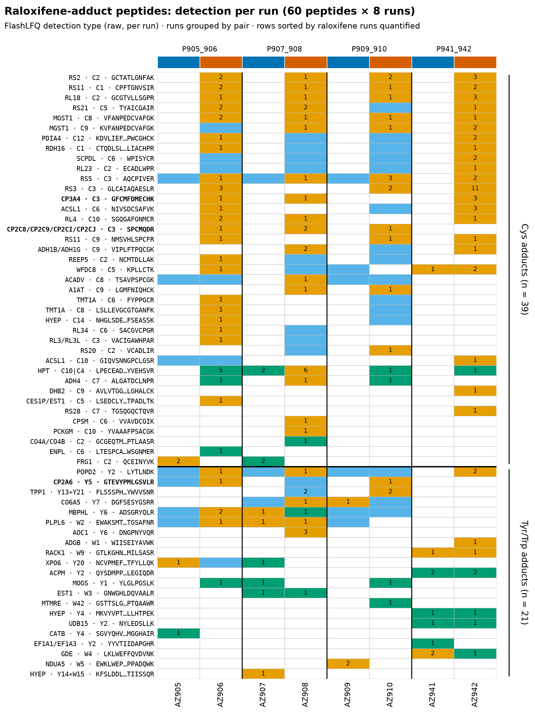
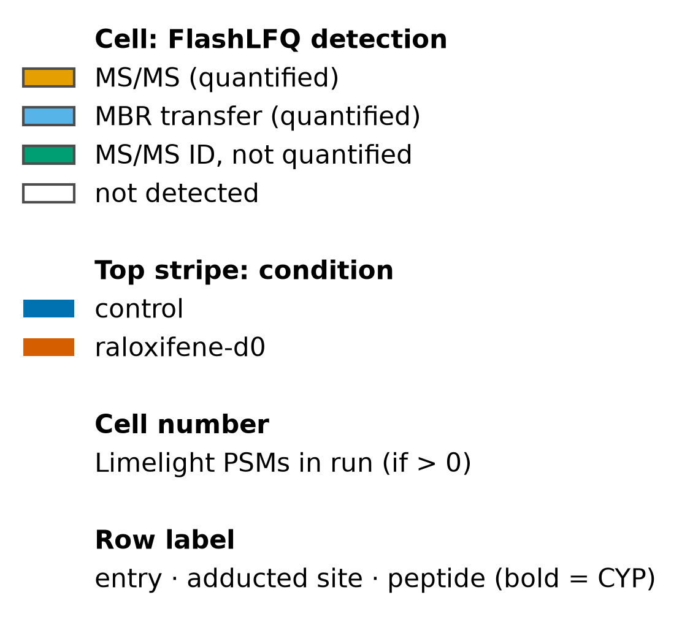
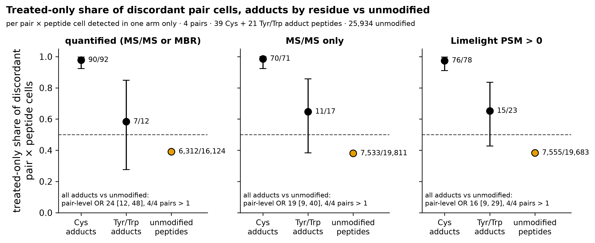
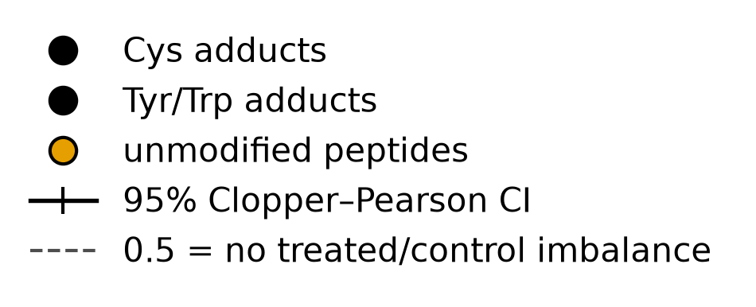
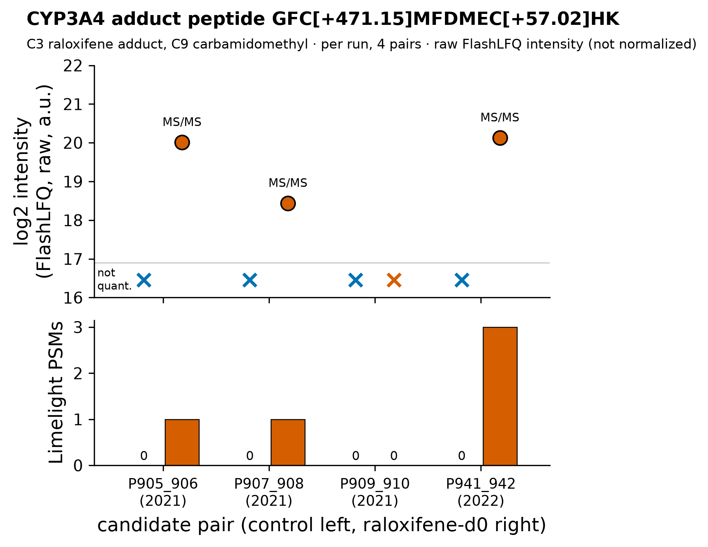
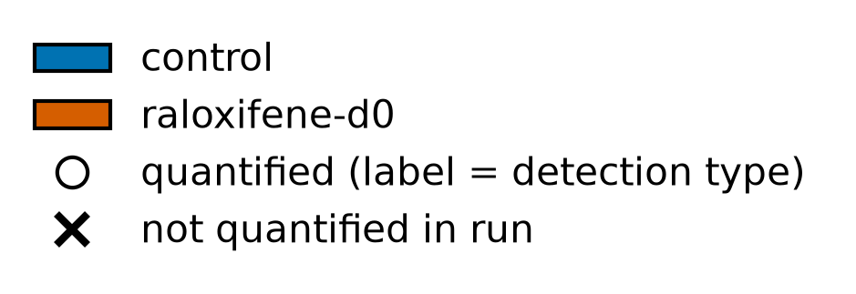

# Cysteine raloxifene-adduct peptides, including on CYP3A4 (Cys58) and CYP2C, are detected almost exclusively in treated samples; Tyr/Trp adduct IDs show no detectable treatment specificity

## Summary
Unique mass decomposition of 33,358 peptide features (16 distinct modification masses, all decomposing uniquely into carbamidomethyl / oxidation / raloxifene, 0 unexplained) recovers 60 raloxifene-adduct peptides across 54 protein groups. The adduct delta, +471.1504 Da, is raloxifene M−2H (a thiol/quinone-methide Michael adduct) and matches the observed value to 3e-5 Da. Cysteine adducts — including the CYP3A4 peptide GFCMFDMECHK (Cys58) and the shared CYP2C peptide SPCMQDR (Cys338) — are detected almost only in raloxifene-treated runs: the treated-only share of discordant pair×peptide detection cells is 0.978 (95% CI 0.924 to 0.997) for Cys, versus a baseline of 0.391 for unmodified peptides, with a pair-level detection odds ratio of 24.0 (95% CI 11.9 to 48.3; 4/4 pairs). The 21 tyrosine/tryptophan adduct IDs show no detectable treatment specificity (0.583, CI 0.277 to 0.848, spanning 0.5).

## Verdict
This is a working positive control: it shows the pipeline detects real, treatment-specific covalent chemistry, which corroborates the near-null differential-abundance result ([finding 0004](0004-no-differential-abundance-raloxifene-vs-control.md)) as a calibration rather than a failure to detect. The Cys detection asymmetry is robust to the run-order confound of [finding 0001](0001-run-order-aliased-with-condition.md), because drift, MBR and carry-over would each bias *against* treated-only specificity, not toward it. It is not a novel capability — proteome-wide raloxifene HLM adductomics is established prior art (Zelter 2024) — and the CYP3A4 site we see (Cys58) is not the canonical raloxifene inactivation site (Cys239). Recorded as an exploratory candidate (4 pairs); adduct sites are search-engine localizations without a localization score, and the Tyr/Trp class shows *no detectable* specificity at low n, which is not the same as being *not* treatment-specific.

## Evidence

**Sixty adduct peptides are recovered by a clean, unambiguous mass decomposition.** Of 33,358 features, every one of the 16 distinct modification masses decomposes uniquely into combinations of carbamidomethyl (+57.0215), oxidation (+15.9949) and raloxifene (+471.1504); there are 0 unexplained and 0 ambiguous masses, and the maximum absolute mass error is 5.9e-5 Da. The raloxifene delta of +471.1504 Da is exactly raloxifene minus two hydrogens (473.1661 − 2H = 471.1504), the signature of a quinone-methide Michael adduct on a nucleophilic residue, and matches the value carried in the quant file to 3e-5 Da. This yields 60 adduct peptides over 54 protein groups: 39 on cysteine, 13 on tyrosine, 7 on tryptophan, 1 on both.

The heatmap below shows where those 60 peptides are detected across the 8 runs.

*Figure 1. Adduct-peptide detection heatmap. Produced by `scripts/scratch/fig_peptide_mods.py` (module `scripts/scratch/analysis_figures/peptide_mods_figs.py`, commit fc32cbc) from `results/peptide-mods/adduct_peptides.tsv` and `adduct_peptides_long.tsv`, data `sha256:bc6b73d3…1ba74`; sidecar `results/peptide-mods/figure_provenance.json`.*

Reading across each row, the colored (detected) cells for the Cys block sit almost entirely in the treated columns of each pair, and the control columns are overwhelmingly "not detected" (the pale background). The Tyr/Trp block below is visibly more mixed — detected cells appear in control as well as treated columns. That contrast between the two row blocks is the whole finding in one picture: 94 cells are MS/MS-quantified, 48 are MBR transfers, 26 are identified-but-not-quantified, and 312 are not detected.

**The treated-only detection asymmetry is large for Cys adducts and absent for Tyr/Trp.** Among discordant pair×peptide cells (detected in exactly one member of a pair), the treated-only share is 0.978 (CI 0.924 to 0.997) for Cys adducts (k/n 90/92), against an unmodified-peptide baseline of 0.391 (CI 0.384 to 0.399). For Tyr/Trp adducts it is 0.583 (CI 0.277 to 0.848) — a confidence interval that spans 0.5, i.e. no detectable treatment specificity. The primary test is at the pair level: the detection odds ratio of adduct versus unmodified peptides is 24.0 (CI 11.9 to 48.3; BH q 0.0022), with all four per-pair ORs above 1 (34.5 / 33.7 / 13.7 / 20.6). Restricting to MS/MS-only identifications (excluding MBR transfers) the Cys treated-only share is 70/71 and the pair-level OR 18.6 (CI 8.7 to 39.6); the PSM definition gives 76/78 and 15.8 (CI 8.5 to 29.4).

*Figure 2. Discordance by residue class. Produced by `scripts/scratch/fig_peptide_mods.py` (module `scripts/scratch/analysis_figures/peptide_mods_figs.py`, commit fc32cbc) from `results/peptide-mods/discordance_class_tests.tsv` and `discordance_by_pair.tsv`, data `sha256:bc6b73d3…1ba74`.*

The Cys point sits at the top of the panel with its whole interval well above the dashed 0.5 line; the unmodified baseline sits near 0.39 with a very tight interval; and the Tyr/Trp point straddles 0.5. So Cys-adduct detection is strongly treated-biased, unmodified detection is (if anything) slightly control-biased, and the Tyr/Trp class is indistinguishable from no asymmetry. Consistent with this, Cys-adduct features are far less likely than Tyr/Trp features to be detected in *any* control run (Fisher OR 0.17, CI 0.04 to 0.68, p 0.005).

**The CYP3A4 adduct peptide is detected only in treated runs.** GFCMFDMECHK carries the raloxifene adduct on Cys58 and a carbamidomethyl on Cys64 (feature mass +528.171864 = 471.1504 + 57.0215). It is identified by MS/MS in three of the four treated runs — AZ906 (log2 intensity 20.01, 1 PSM), AZ908 (18.44, 1 PSM) and AZ942 (20.13, 3 PSM) — and is not detected in the fourth treated run (AZ910) nor in any of the four controls.

*Figure 3. CYP3A4 adduct peptide across runs. Produced by `scripts/scratch/fig_peptide_mods.py` (module `scripts/scratch/analysis_figures/peptide_mods_figs.py`, commit fc32cbc) from `results/peptide-mods/adduct_peptides.tsv`, data `sha256:bc6b73d3…1ba74`.*

The three treated bars carry MS/MS identifications and non-trivial intensity; the four control positions and the fourth treated run are empty (not detected). This is the single-peptide view of the class-level asymmetry in Figure 2. The shared CYP2C peptide SPCMQDR (adduct on Cys338) behaves the same way — MS/MS in 3/4 treated, 0/4 control. A tyrosine adduct on CYP2A6 (GTEVYPMLGSVLR, Tyr5) is also present but is most likely a false positive, consistent with the Tyr/Trp class carrying no treatment signal.

**The adducted proteins are the expected reactive-metabolite targets.** Beyond the CYPs, the adducted set (full list in `results/peptide-mods/adduct_proteins.tsv`) includes MGST1, ACSL1, TMT1A, the alcohol-dehydrogenase family, PDIA4 and many ribosomal proteins. The median treated adduct fraction is ≈2.5%, but this is not an occupancy estimate: it assumes adducted and unadducted forms ionize equally.

## Methods / how to produce
Run `scripts/scratch/peptide_mod_analysis.py` (module `scripts/scratch/analysis/peptide_mods.py`, written from scratch — no `lib/` template) at commit fc32cbc on data `sha256:bc6b73d30e40d6ec190f8cd4494ec58d984a475f670d5aab5d8b238974d1ba74`, under `pyproject.toml` + `uv.lock` (Python 3.12.3, numpy 2.5.3, pandas 3.0.6). The sample set is all 8 experimental runs in 4 matched control/raloxifene-d0 pairs (P905_906, P907_908, P909_910, P941_942); there are no QC or pool controls. Each of the 33,358 features' total modification mass is decomposed against {CAM +57.021464, Ox +15.994915, Ralox +471.15042928479} at 0.001 Da tolerance. Detection asymmetry is assessed on discordant pair×peptide cells under three definitions (FlashLFQ quantified = MSMS or MBR; MSMS-only; Limelight PSM > 0), with an exact two-sided binomial (Clopper-Pearson 95% CI) as a descriptive cell-level summary and a pair-stratified (Mantel-Haenszel) odds ratio plus pair-level sign test as the primary test. Cys vs non-Cys comparisons use Fisher's exact test. Outputs are under `results/peptide-mods/` (`summary.json`, `adduct_peptides*.tsv`, `adduct_proteins.tsv`, `discordance_*`, `mass_decomposition.tsv`). Figures are produced by `scripts/scratch/fig_peptide_mods.py` (module `scripts/scratch/analysis_figures/peptide_mods_figs.py`); provenance sidecar `results/peptide-mods/figure_provenance.json`. The statistics review passed with mandatory wording (the asymmetry must not be attributed to drift; the Tyr/Trp class is "no detectable treatment specificity").

## Discussion
The result is best read as an internal positive control. An in vitro microsomal raloxifene incubation is expected to produce covalent quinone-methide adducts on nucleophilic cysteines, and recovering them almost exclusively in the treated runs shows the search, mass decomposition and detection pipeline are working — which is what licenses reading the near-null abundance result of [finding 0004](0004-no-differential-abundance-raloxifene-vs-control.md) as a calibrated null rather than an insensitive assay. The chemistry is consistent with the literature: raloxifene is bioactivated to a diquinone methide that adds to thiols with a net mass of M−2H = 471.1504 Da (Yu 2004; the +471 Da protein adduct is the species Baer 2007 localized on CYP3A4).

Two positioning points are important and must not be overstated. First, this is *not* a novel capability: Zelter et al. 2024 already mapped the raloxifene adductome proteome-wide in human liver microsomes (78 proteins, 127 peptides), and our overlapping hit list (CYP3A/2C, MGST1, dehydrogenases, carboxylesterase, ribosomal proteins) and the shared, non-uniquely-assignable SPCMQDR CYP2C peptide (Cys338) reproduce their observations — so this is a methods demonstration consistent with prior art, not a discovery. Second, our CYP3A4 adduct sits on Cys58 (in GFCMFDMECHK, residues 56-66), which is *not* the canonical raloxifene inactivation site Cys239 (Baer 2007; Cys239 lies in the different tryptic peptide 213-243). Detecting an adduct is also not the same as inactivation: raloxifene time-dependent inactivation of CYP2C is reported for CYP2C8 at Cys225 (VandenBrink 2012), a different residue from the Cys338 we detect, and Zelter 2024 explicitly show adducts can be benign. The non-CYP targets (MGST1, PDIA4) are expected reactive-metabolite targets per independent adductomics literature (Liu 2005).

## Caveats
1. **Exploratory, minimal design.** 4 matched pairs, residual df 3. All results are hypothesis-generating.
2. **Robust to the run-order confound — this is why [finding 0001](0001-run-order-aliased-with-condition.md) does not undermine this result.** Run order is aliased with condition (control run first in every pair). But every mechanism that aliasing could invoke biases *against* the treated-only asymmetry, not toward it: because controls were acquired first, treated→control carry-over is chronologically impossible; match-between-runs (MBR) moves identifications *into* the controls, which would erode (not create) the asymmetry; and the asymmetry survives with MBR transfers removed (MS/MS-only Cys treated-only share 70/71). So the confound cannot manufacture this signal — it can only weaken it.
3. **Sites are search-engine localizations.** The adducted residue positions (Cys58, Cys338, etc.) come from the search engine's localization and carry no localization score; they are residue + position within the peptide.
4. **Tyr/Trp: no *detectable* treatment specificity — not "not treatment-specific".** The Tyr/Trp treated-only share (0.583, CI 0.277 to 0.848) spans 0.5 at low n (21 features), and the Cys/non-Cys split was defined post hoc. The correct statement is that no treatment specificity is detectable in this class here, not that the class is treatment-independent.
5. **Cell-level p is descriptive only.** The exact-binomial p-values on discordant cells (e.g. 1.7e-24 for Cys) treat cells as independent, which they are not across a peptide's pairs or a run's peptides; the pair-level OR is the primary inferential test.
6. **Not a novel capability, and not the inactivation site.** Cite Zelter 2024 as prior art; the CYP3A4 adduct here (Cys58) differs from the canonical inactivation site Cys239 (Baer 2007), and adduction ≠ inactivation.
7. **Adduct fraction is not occupancy.** The ≈2.5% median treated adduct fraction assumes equal ionization of adducted and unadducted peptide forms.
8. **CYP2C assignment is ambiguous.** SPCMQDR (Cys338) is shared across CYP2C8/2C9/2C18/2C19 and cannot be assigned to one paralog (Zelter 2024 concurs).

## Follow-ups
- Ask a blinded verifier to re-derive the Cys-vs-Tyr/Trp treated-only asymmetry from the pinned data under a pre-specified concordance criterion.
- Cross-check our adducted-protein and adducted-site list against the Zelter 2024 HLM adductome (overlap, and any sites unique to this dataset).
- Confirm whether the CYP2A6 tyrosine adduct is a false positive by inspecting its spectra.
- Promote the analysis and figure scripts to `scripts/promoted/` before any validation attempt.

## Related findings
- [Finding 0001 (run order aliased with condition)](0001-run-order-aliased-with-condition.md) — `relates_to`. The control was run first in every pair, so detection is confounded with run order; but every drift/MBR/carry-over mechanism biases against this treated-only asymmetry, so the confound cannot explain it.
- [Finding 0004 (no differential abundance)](0004-no-differential-abundance-raloxifene-vs-control.md) — `relates_to`. This positive control corroborates that the near-null abundance result there is a calibrated null, not an insensitive pipeline.

## References
- Zelter A, Riffle M, … MacCoss MJ, Isoherranen N. Detection and Quantification of Drug-Protein Adducts in Human Liver. J Proteome Res. 2024;23(11):5143-5152. doi:10.1021/acs.jproteome.4c00663. PMID 39442081. — Prior art: proteome-wide raloxifene HLM adductome; shared SPCMQDR; adducts can be benign.
- Baer BR, Wienkers LC, Rock DA. Time-dependent inactivation of P450 3A4 by raloxifene: identification of Cys239 as the site of apoprotein alkylation. Chem Res Toxicol. 2007;20(6):954-964. doi:10.1021/tx700037e. PMID 17497897. — Canonical inactivation site Cys239 (≠ our Cys58); +471 Da adduct.
- VandenBrink BM, et al. Cytochrome P450 architecture and cysteine nucleophile placement impact raloxifene-mediated mechanism-based inactivation. Mol Pharmacol. 2012;82(5):835-842. doi:10.1124/mol.112.080739. PMID 22859722. — CYP2C8 TDI at Cys225; adduction ≠ inactivation.
- Yu L, et al. Oxidation of Raloxifene to Quinoids. Chem Res Toxicol. 2004;17(7):879-888. doi:10.1021/tx0342722. — Diquinone-methide Michael adduct chemistry (M−2H).
- Liu J, et al. Raloxifene COATag probe, rat liver microsomes. Chem Res Toxicol. 2005;18(9):1485-1496. PMID 16167842. — Non-CYP targets (MGST1, PDIs) are expected.
- Raloxifene, PubChem CID 5035 (C28H27NO4S, monoisotopic 473.16608 Da; M−2H = 471.1504 Da).
</content>
