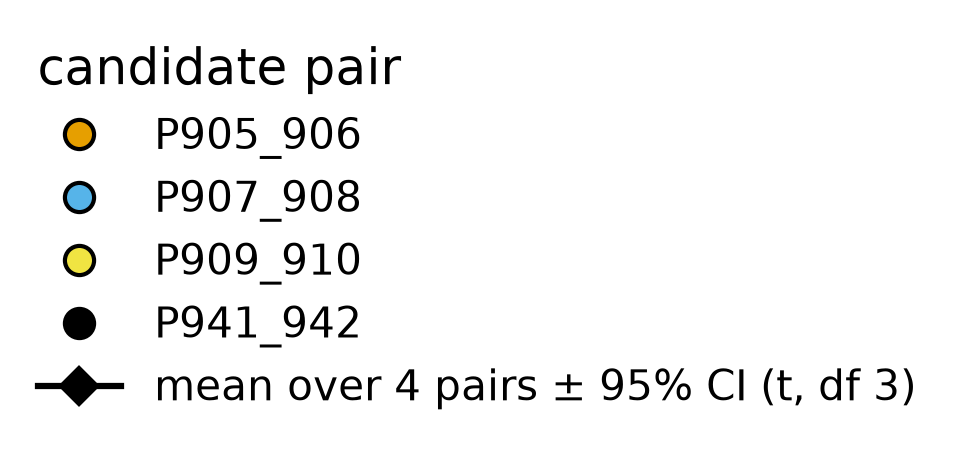
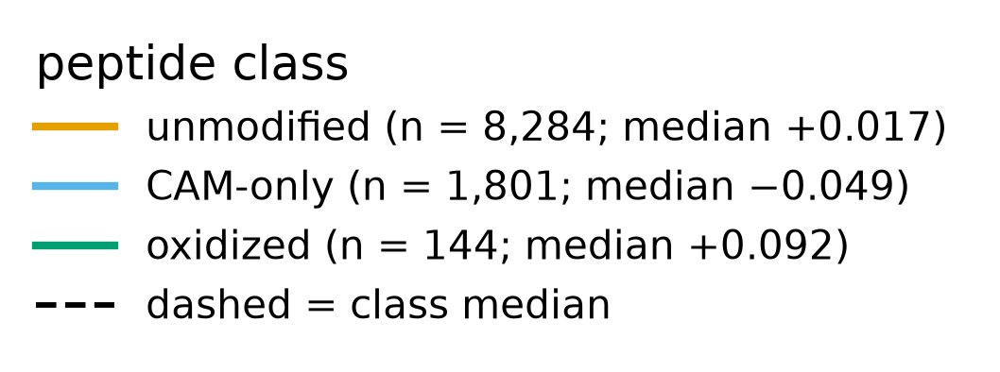
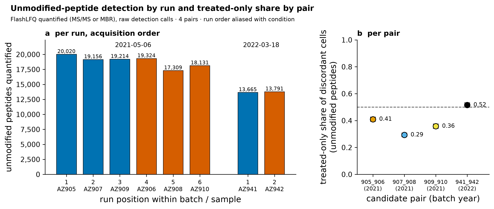
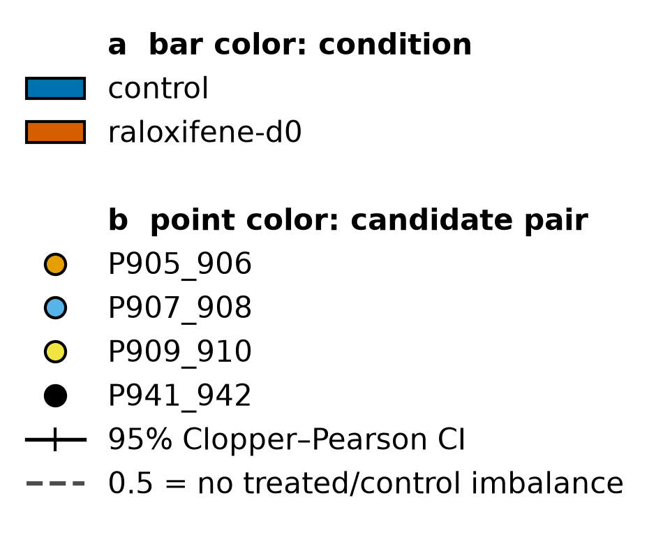

# Small, consistent modification-class shifts with treatment (CAM/Cys peptides lower, oxidized forms higher), all confounded with run order; oxidation evidence is mixed

## Summary
In the complete-case paired peptide set (10,229 peptides), two small modification-class shifts move consistently with treatment: carbamidomethyl-only (Cys) peptides are slightly lower in the raloxifene member of each pair (paired log2FC −0.066, 95% CI −0.101 to −0.032, 4/4 pairs, q 0.009) and oxidized peptides slightly higher (+0.073, CI 0.040 to 0.106, 4/4 pairs, q 0.009). The class-level detection asymmetry runs the same way (pair-level OR vs unmodified 0.73 for CAM-only, 1.42 for oxidized). Every effect is small (<0.12 log2, <9%) and every one is fully confounded with run order: control was run first in every pair. The CAM-only decrease survives protein-level adjustment (−0.056, p 0.0077); the oxidation increase does not (+0.076, p 0.072), and the global oxidation index and per-protein tests are non-significant.

## Verdict
These are small, coherent, treatment-associated shifts in both modification-class abundance and detection — but all of them are confounded with run order, so the mechanism is undetermined and must *not* be called "drift". The CAM-only (Cys-peptide) decrease is the firmer of the two, because it persists after removing each peptide's own protein-level fold change. The oxidation-increase signal is genuinely mixed and has to be reported that way: the +0.073 class shift does not survive protein adjustment (p 0.072), the global oxidation index is non-significant (p 0.55 complete-case, 0.10 missing-as-zero), and 0 of 64 proteins pass per-protein testing (q<0.10). Recorded as an exploratory candidate (4 pairs); a global BH across the many pair-level class tests is still owed. The CAM-only shift is not attributable to the observed Cys–raloxifene adducts of [finding 0008](0008-raloxifene-cys-adducts-treatment-specific.md): there are only 39 adduct features at a ≈2.5% fraction.

## Evidence

**Two small class shifts move consistently across all four pairs.** The CAM-only − unmodified paired shift is −0.066 (CI −0.101 to −0.032), negative in all four pairs (−0.045 / −0.068 / −0.057 / −0.096); the oxidized − unmodified shift is +0.073 (CI 0.040 to 0.106), positive in all four (0.066 / 0.048 / 0.083 / 0.096); and among the 123 base sequences with both an oxidized and an unoxidized form quantified, the oxidized-form − unoxidized-form shift is +0.121 (CI 0.024 to 0.218), again 4/4 pairs.

*Figure 1. Per-pair class shifts. Produced by `scripts/scratch/fig_peptide_mods.py` (module `scripts/scratch/analysis_figures/peptide_mods_figs.py`, commit fc32cbc) from `results/peptide-mods/class_log2fc_tests.tsv` and `modified_vs_reference_class_tests.tsv`, data `sha256:bc6b73d3…1ba74`.*

Each row is one class contrast; the large marker is the pair-level mean and the four small markers are the individual pairs. The CAM-only mean sits left of the dashed zero line with all four pairs on the same (negative) side; the two oxidation contrasts sit right of zero with all four pairs positive. The consistency across pairs is what makes these effects real as *associations* — but note that all four pairs share the same control-first run order, which Figure 3 and the caveats return to.

**The shifts are small relative to between-peptide spread.** The class medians differ by less than 0.12 log2 (under 9%), while each class's per-peptide log2FC distribution has a spread of roughly 0.25 SD.

*Figure 2. Class log2FC distributions. Produced by `scripts/scratch/fig_peptide_mods.py` (module `scripts/scratch/analysis_figures/peptide_mods_figs.py`, commit fc32cbc) from `results/peptide-mods/class_log2fc.tsv`, data `sha256:bc6b73d3…1ba74`.*

The three density curves sit almost on top of one another, centered near zero; the CAM-only curve's median is nudged left and the oxidized curve's median nudged right, but the offsets are tiny next to the width of each curve. The message is that these are small mean displacements of broad, overlapping distributions — detectable because they are consistent across pairs, not because any individual peptide moves a lot.

**The detection asymmetry runs the same direction as the intensity shifts, and the unmodified baseline itself depends on run position.** By class, the pair-level detection OR versus unmodified is 0.73 for CAM-only (4/4 pairs OR<1, p 0.027) and 1.42 for oxidized (4/4 pairs OR>1, p 0.012): fewer CAM detections and more oxidized detections in the treated member. Underneath that, the unmodified-peptide detection baseline is itself run-position-dependent: in the three 2021-05-06 pairs the treated-only share of discordant unmodified cells is 0.41 / 0.29 / 0.36 (the later-run treated member detects *fewer* peptides than its control), while the single 2022-03-18 pair is 0.52.

*Figure 3. Baseline detection by run position. Produced by `scripts/scratch/fig_peptide_mods.py` (module `scripts/scratch/analysis_figures/peptide_mods_figs.py`, commit fc32cbc) from `results/peptide-mods/discordance_by_pair.tsv`, data `sha256:bc6b73d3…1ba74`.*

Three of the four pairs sit below the dashed 0.5 line, meaning the treated (later-acquired) run identifies fewer unmodified peptides than its paired control. Because condition and run order are aliased ([finding 0001](0001-run-order-aliased-with-condition.md)), this baseline shift cannot be separated from treatment, and it is the backdrop against which the small class shifts must be read.

**The CAM-only shift survives protein adjustment; the oxidation shift does not, and its other tests are non-significant.** Removing each peptide's own protein-level fold change (pair-median centred), the CAM-only decrease persists (−0.056, p 0.0077), so it is not merely a protein-abundance artifact. The oxidation increase, by contrast, does *not* survive (+0.076, p 0.072); the global oxidized/unoxidized index is non-significant both complete-case (+0.038, p 0.55) and missing-as-zero (+0.096, p 0.10); and no protein passes per-protein testing (0 of 64 at q<0.10, min q 0.447). The oxidation evidence is therefore mixed and is reported here as the full set, not the significant subset alone.

## Methods / how to produce
Run `scripts/scratch/peptide_mod_analysis.py` (module `scripts/scratch/analysis/peptide_mods.py`, written from scratch) at commit fc32cbc on data `sha256:bc6b73d30e40d6ec190f8cd4494ec58d984a475f670d5aab5d8b238974d1ba74`, under `pyproject.toml` + `uv.lock` (Python 3.12.3, numpy 2.5.3, pandas 3.0.6). The quantity is LFQ peptide (median-normalized log2, 10,229 complete-case features), paired within the four candidate pairs (P905_906, P907_908, P909_910, P941_942). Per class, the per-peptide paired log2FC (ralox − control) is summarized and the (class − unmodified) mean shift is tested at the pair level with a paired t (df 3), BH-corrected within the class family. Protein adjustment subtracts each peptide's protein-level paired log2FC (pair-median centred) before the same test. The matched-form contrast (oxidized − unoxidized) uses the 123 base sequences with both forms quantified. The global oxidation index is the per-pair log2 ratio of summed oxidized to unoxidized intensity, tested complete-case and missing-as-zero, and per protein (BH over 64). Detection asymmetry by class uses a pair-stratified OR on discordant detection cells. Outputs are under `results/peptide-mods/` (`class_log2fc*.tsv`, `protein_adjusted*.tsv`, `modified_vs_reference*.tsv`, `oxidation_index_*.tsv`, `discordance_*`). Figures are from `scripts/scratch/fig_peptide_mods.py` (module `scripts/scratch/analysis_figures/peptide_mods_figs.py`); provenance sidecar `results/peptide-mods/figure_provenance.json`. The statistics review passed with mandatory wording: the shifts must not be called "drift"; the oxidation shift must be reported together with its non-significant protein-adjusted, global-index and per-protein results.

## Discussion
These are the kind of small, systematic effects that a modification-aware peptide analysis surfaces beneath a protein-abundance null ([finding 0004](0004-no-differential-abundance-raloxifene-vs-control.md)): the class means move only a few percent, but they move the same way in every pair, which is why they clear a pair-level test. The direction is internally coherent — CAM-only (Cys) peptides both decrease in intensity and are detected less often in the treated member, while oxidized peptides both increase and are detected more often.

What cannot be said is *why*. Because control was run first in every pair, run order is perfectly aliased with condition ([finding 0001](0001-run-order-aliased-with-condition.md)), and the run-position dependence of the unmodified detection baseline (Figure 3) shows the acquisition sequence alone moves these readouts. The mechanism is therefore undetermined, and this must not be described as "drift" — that names a specific cause the design cannot support. It is tempting to link the CAM-only decrease to the raloxifene Cys adducts of [finding 0008](0008-raloxifene-cys-adducts-treatment-specific.md) (an adducted cysteine cannot also be carbamidomethylated), but the arithmetic does not support that: there are only 39 adduct features at a ≈2.5% median fraction, far too few to move a class of 1,801 CAM-only peptides by 0.06 log2. The two observations are directionally suggestive but not causally connected by this evidence.

## Caveats
1. **Exploratory, minimal design.** 4 matched pairs, residual df 3; all pair-level tests rest on 4 values.
2. **All shifts are confounded with run order; mechanism undetermined — do NOT call it "drift".** Control was run first in every pair ([finding 0001](0001-run-order-aliased-with-condition.md)), so condition and run position are aliased. The unmodified detection baseline is itself run-position-dependent (Figure 3). No mechanism (drift, column state, sample age, treatment) can be singled out.
3. **Oxidation evidence is mixed and must be reported in full.** The +0.073 class shift is significant, but the protein-adjusted version is not (p 0.072), the global oxidation index is non-significant (p 0.55 complete-case, 0.10 missing-as-zero), and 0 of 64 proteins pass per-protein testing (q<0.10). Do not headline only the significant subset.
4. **The CAM-only shift is firmer but not attributable to the observed Cys adducts.** It survives protein adjustment (−0.056, p 0.0077), unlike the oxidation shift. It is not explained by the 39 raloxifene Cys adducts of [finding 0008](0008-raloxifene-cys-adducts-treatment-specific.md) (≈2.5% fraction is far too small).
5. **Effects are small relative to spread.** All class means differ by <0.12 log2 (<9%), against a per-peptide log2FC spread of ~0.25 SD (Figure 2).
6. **Multiplicity — a global BH is owed.** BH was applied only within small class families (per test). A global BH across all the pair-level class tests run here has not been applied and is still owed.
7. **The 2022 pair shows the largest shifts.** P941_942 (the single 2022-03-18 pair, run back-to-back) has the largest per-pair CAM-only (−0.096) and oxidation (0.096) shifts. That weakly argues against a mechanism proportional to the inter-run time gap, but it is n=1 and cannot be leaned on.

## Follow-ups
- Apply a global BH across all pair-level class tests and report which survive.
- Ask whether a run-order-only (non-treatment) model can reproduce the class shifts and the baseline detection pattern of Figure 3.
- Have a blinded verifier re-derive the CAM-only shift and its protein-adjusted version under a pre-specified concordance criterion.
- Promote the analysis and figure scripts to `scripts/promoted/` before any validation attempt.

## Related findings
- [Finding 0001 (run order aliased with condition)](0001-run-order-aliased-with-condition.md) — `relates_to`. Control was run first in every pair, so all class and detection shifts are confounded with run position; this is why the mechanism is undetermined.
- [Finding 0003 (samples structured by matched pairs)](0003-samples-structured-by-matched-pairs.md) — `relates_to`. The analysis is paired on candidate pair, and the shifts are per-pair paired differences.
- [Finding 0004 (no differential abundance)](0004-no-differential-abundance-raloxifene-vs-control.md) — `relates_to`. Same complete-case paired peptide set (10,229) and design; these are small within-peptide class effects sitting beneath that protein-level null.
- [Finding 0008 (raloxifene Cys adducts, treatment-specific)](0008-raloxifene-cys-adducts-treatment-specific.md) — mentioned as a candidate but rejected explanation for the CAM-only shift (too few adduct features). No edge asserted; surfaced for the scientist to type if wanted.

## References
None. All statements are about this dataset or are general statistical background (blocking, BH, run-order aliasing); no external-knowledge claim is made here.
</content>
