# LFQ and spectral counts agree on which proteins are abundant; most residual disagreement is explained by shared-peptide handling, protein length, and the low-count floor

## Summary
On the 20,114 run×protein cells (3,414 proteins) where FlashLFQ protein intensity and Limelight spectral abundance both quantify a protein, the two agree strongly on *which proteins are abundant*: pooled per-cell Spearman ρ 0.863 [0.850, 0.874] vs PSM counts and 0.786 [0.772, 0.801] vs NSAF, consistent across runs and both acquisition batches (per-run 0.858–0.878). The residual disagreement is not mysterious — it is largely accounted for by a zero-truncated-Poisson count floor (~29% of PSM residual variance, 32–43% in lower LFQ deciles), by FlashLFQ's use of unique peptides only (PSM residual tracks shared-peptide inflation, slope 0.918 [0.842, 0.989]), and by NSAF's division by protein length (NSAF residual tracks length, slope −0.925 [−0.965, −0.880]).

## Verdict
LFQ and spectral counts rank protein abundance within a run essentially the same way (ρ≈0.86 vs PSM, ρ≈0.79 vs NSAF), and where they part ways the causes are identifiable: the low-count floor, shared-peptide handling, length normalization, and detection differences. This is an **agreement-structure** description. It makes **no** claim that any measure is more precise or more accurate — there is no ground truth here, so no such claim is possible. The regression slope between the measures is **not identified** (0.77 OLS to 0.98 inverse-OLS on the protein scale, 1.33 SMA on a per-peptide scale), so this must **not** be described as "compression". The lower LFQ–NSAF agreement reflects NSAF's length division, not that NSAF is a worse abundance measure.

## Evidence

**LFQ and spectral abundance agree strongly, and the agreement is stable across runs and batches.** Over 20,114 common cells (3,414 proteins), the pooled per-cell Spearman ρ is 0.863 [0.850, 0.874] against PSM counts and 0.786 [0.772, 0.801] against NSAF; on protein means over the 1,648 complete-in-all-8-runs proteins the LFQ–PSM Pearson r is 0.888. The density of the joint distribution is a single tight ridge, not a diffuse cloud.

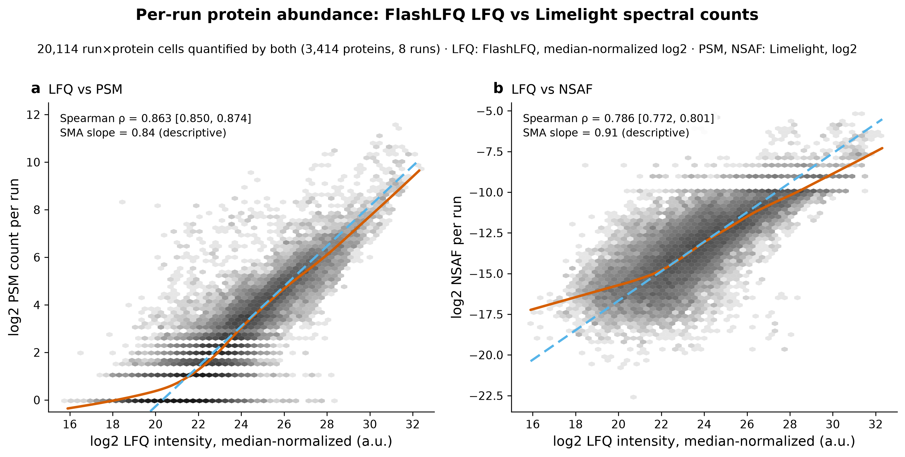

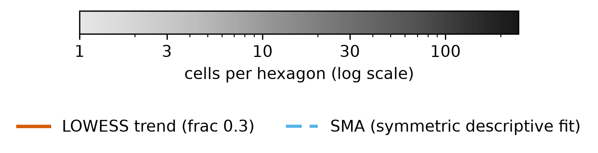

*Figure 1. LFQ vs spectral abundance, per cell. Produced by `scripts/scratch/fig_abundance_agreement.py` (6f1631b) from data `sha256:bc6b73d3…`.*

Each hexagon is a bin of run×protein cells positioned by LFQ (x) against a spectral measure (y). The mass lies along a single diagonal ridge in both panels — high-LFQ proteins carry high PSM/NSAF and low-LFQ proteins low — which is what a strong monotone agreement looks like; the ridge is slightly tighter for PSM (ρ 0.86) than NSAF (ρ 0.79).

**The agreement does not depend on which run you look at.** Per-run Spearman ρ is 0.858–0.878 for LFQ–PSM and 0.763–0.812 for LFQ–NSAF, with the two batches interleaved rather than separated.

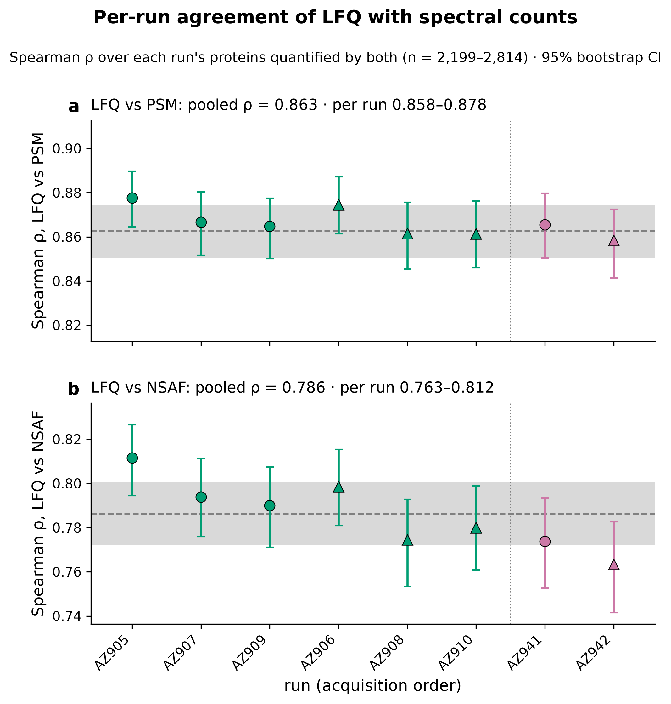

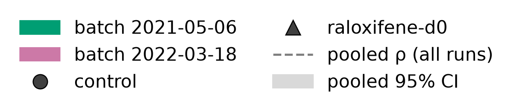

*Figure 2. Per-run agreement. Produced by `scripts/scratch/fig_abundance_agreement.py` (6f1631b) from data `sha256:bc6b73d3…`.*

Every run sits inside a narrow band around the pooled value and the two batch colors are intermixed, so the agreement is a stable property of the data rather than an artifact of pooling or of one batch.

**The slope between the measures is model-dependent — this is not "compression".** log2 PSM on LFQ gives OLS 0.77, SMA 0.87, orthogonal 0.85, inverse-OLS 0.98 on the protein-mean scale; on a per-unique-peptide LFQ scale SMA is 1.33 (spectral counts look *expanded*). The LOWESS local slope wanders 0.67→0.96 across the LFQ range, so the relationship is not even a single line.

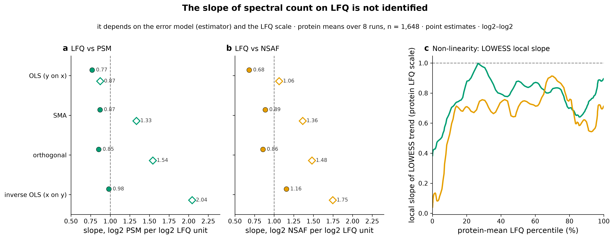

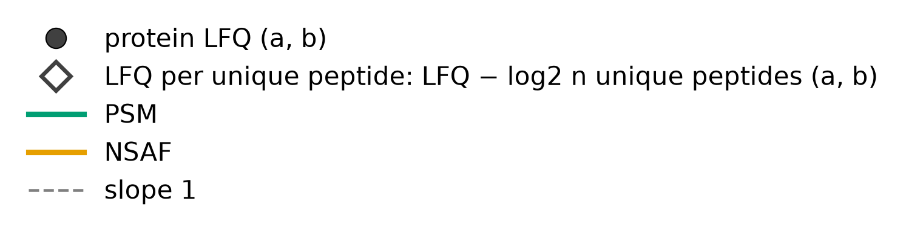

*Figure 3. Slope is not identified. Produced by `scripts/scratch/fig_abundance_agreement.py` (6f1631b) from data `sha256:bc6b73d3…`.*

The estimated slope moves from below 1 to essentially 1 depending only on which variable is treated as error-free and on the abundance scale — and flips to >1 on the per-peptide scale. Read together, that spread is the point: the data do not pin a single slope, so any narrative of systematic "compression" is unsupported.

**Agreement is worst where counts are smallest, and a Poisson floor explains much of it.** 35% of common cells have ≤3 PSMs (17% exactly 1). The zero-truncated-Poisson counting floor accounts for ~29% of the pooled PSM residual variance overall and 32–43% in the lower LFQ deciles, and within-PSM-bin Spearman rises monotonically from 0.23 (2–3 PSMs) to 0.59 (≥32 PSMs).

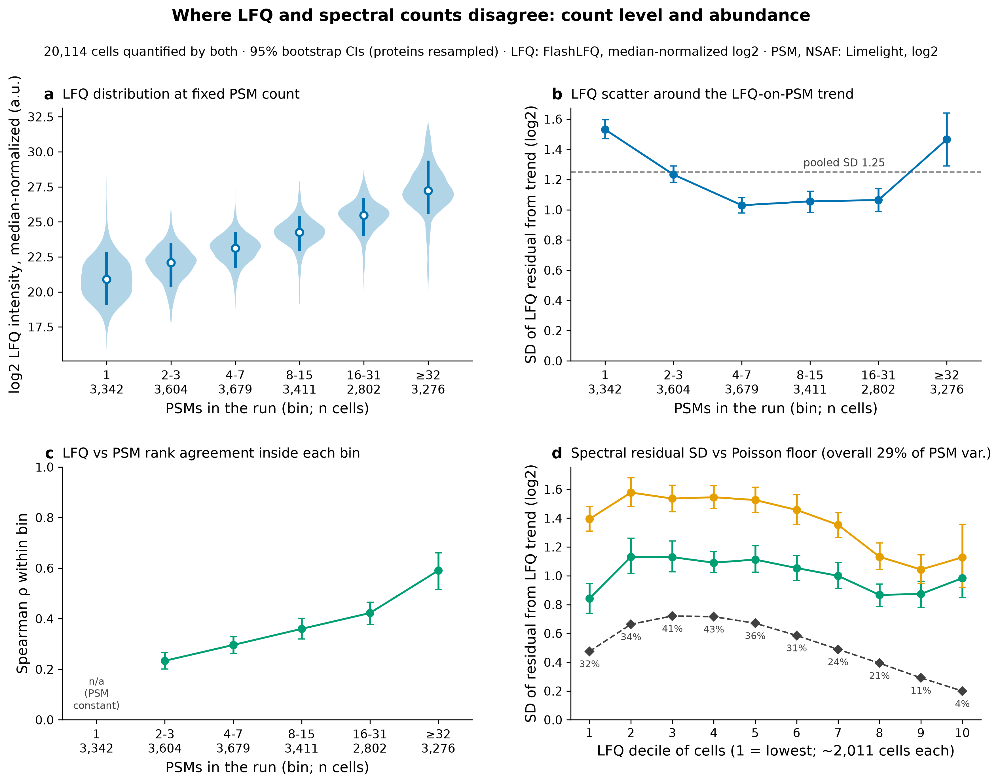

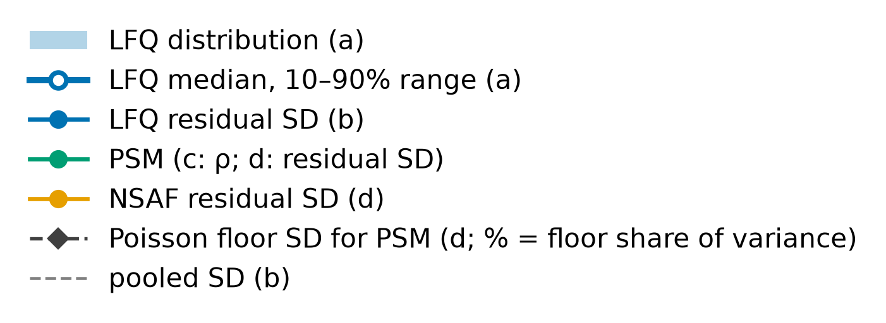

*Figure 4. The low-count floor. Produced by `scripts/scratch/fig_abundance_agreement.py` (6f1631b) from data `sha256:bc6b73d3…`.*

Where proteins carry many PSMs the within-bin correlation is high and the residual approaches the Poisson floor; where they carry few, the counting noise dominates and the correlation collapses. Much of the "disagreement" is simply that a spectral count of 1–3 cannot resolve abundance.

**The systematic residuals track exactly the quantities the definitions predict.** In a 4-term protein-mean regression (HC3), the PSM residual scales with shared-peptide inflation −log2(1−f) at slope 0.918 [0.842, 0.989] — algebraic expectation 1, because FlashLFQ protein quant uses unique peptides only while PSM/NSAF count all PSMs (this term drops ΔR² 0.450). The NSAF residual scales with log2 relative length at slope −0.925 [−0.965, −0.880] — expectation −1, because NSAF divides by length (ΔR² 0.411). Removing shared-peptide PSMs raises the LFQ–log2PSM protein-mean Pearson from 0.885 to 0.934.

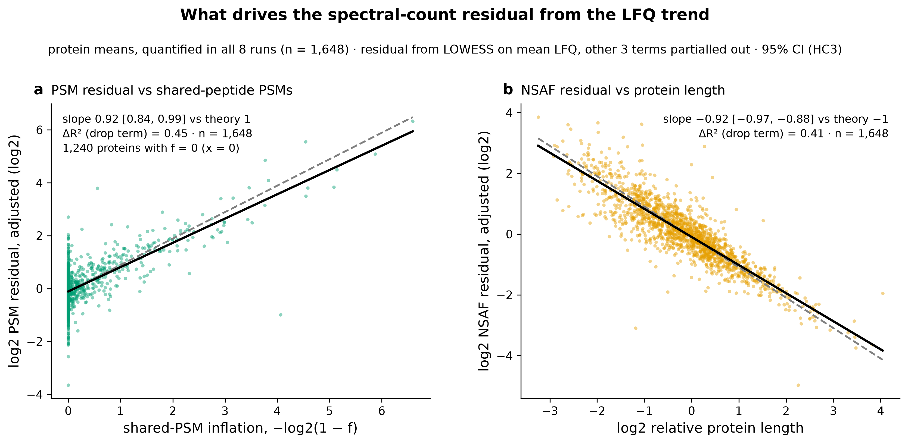

*Figure 5. Residual drivers match the definitions. Produced by `scripts/scratch/fig_abundance_agreement.py` (6f1631b) from data `sha256:bc6b73d3…`.*

Both partial slopes fall on their algebraic expectation lines: the more a protein's PSMs come from shared peptides, the higher its counts sit above its LFQ (slope ≈1), and the longer a protein, the lower its NSAF sits (slope ≈−1). The residuals are the *definitions* of the measures, not random noise.

**Agreement is also conditional on both methods detecting the protein.** Per run, proteins split into both-quantified, PSM-only (no LFQ in any run), PSM-only (LFQ elsewhere), and LFQ-only. Both-class proteins carry a median of 7 PSMs vs 3 for PSM-only, and every one of the 1,491 LFQ-only cells is MBR-only (match-between-runs, no MS/MS in that run).

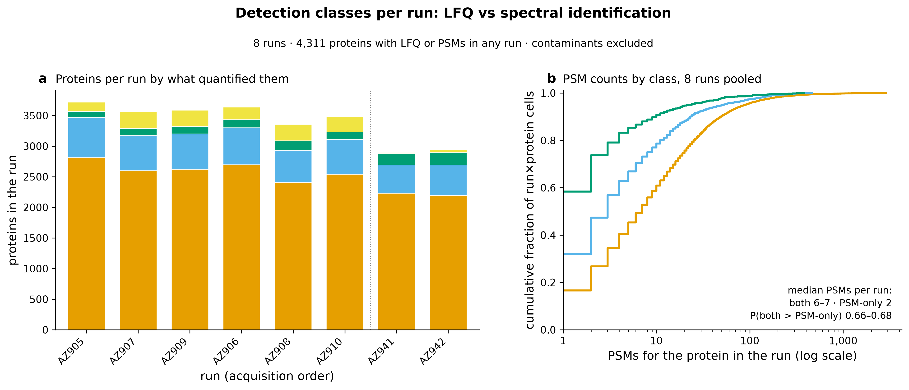

*Figure 6. Detection classes per run. Produced by `scripts/scratch/fig_abundance_agreement.py` (6f1631b) from data `sha256:bc6b73d3…`.*

The both-quantified block dominates every run, but a substantial PSM-only block sits beneath it at low PSM counts — the proteins on which the two methods do not even co-report, which is why the agreement statistics are conditional on joint detection.

**Detection failure on the LFQ side has specific, countable causes.** 897 proteins carry PSMs but never receive an LFQ value: 671 share all their peptides with other proteins (51,669 PSMs), 220 have unique peptides that were never MS1-quantified (2,965 PSMs), and 6 carry a FlashLFQ NaN token. The top offenders are shared-peptide protein families — CES1P, CYB5, the UGT family, tubulins and actins.

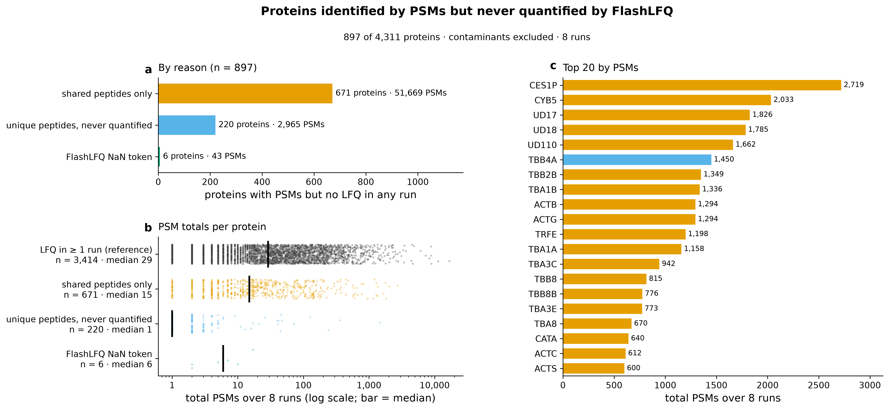

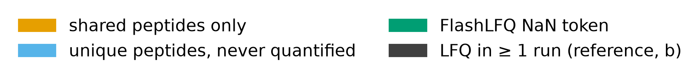

*Figure 7. Why proteins get no LFQ. Produced by `scripts/scratch/fig_abundance_agreement.py` (6f1631b) from data `sha256:bc6b73d3…`.*

Most of the lost LFQ mass is the shared-peptides-only class: high-PSM proteins (CES1P 2,719 PSMs, CYB5 2,033) whose peptides are all shared with a paralog or a contaminant copy, so FlashLFQ's unique-peptide quant assigns them nothing. This is the detection asymmetry that the abundance agreement is conditioned on — and, for the contaminant-copy subset, the subject of a separate caveat.

**Within a protein, PSM and LFQ track each other across runs between pairs but not within a pair.** Over the complete8 proteins, the between-pair-mean per-protein r has median 0.85 (permutation p 0.042, the minimum attainable with 24 relabelings), while the within-pair per-protein r has median only 0.16 (p 0.125, min attainable with 16 swaps). Tracking improves steeply with count, from median r 0.21 (mean PSM 1) to 0.85 (≥32).

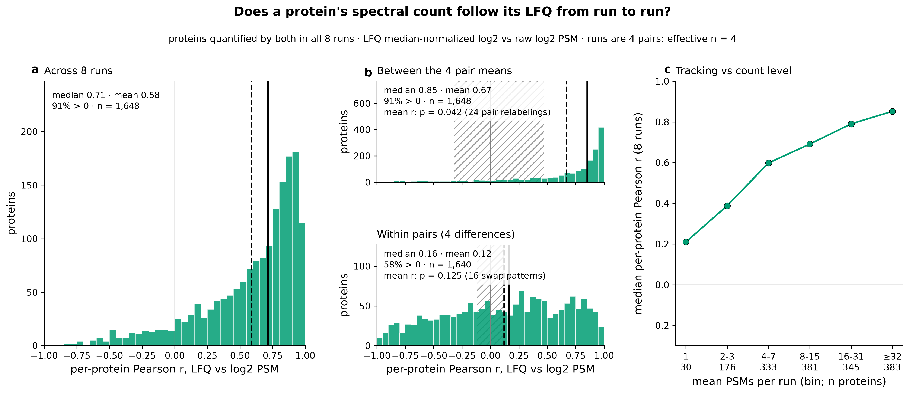

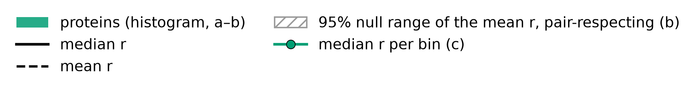

*Figure 8. Within-protein tracking. Produced by `scripts/scratch/fig_abundance_agreement.py` (6f1631b) from data `sha256:bc6b73d3…`.*

The between-pair distribution sits well to the right (proteins that are higher in one pair are higher by both measures), but the within-pair distribution is centered near zero — at the small within-pair count differences, the two measures no longer co-vary, which is the same low-count floor seen in Figure 4 acting on the paired design.

## Methods / how to produce
Run `scripts/scratch/abundance_agreement.py` (commit 6f1631b; module `scripts/scratch/analysis/abundance_agreement.py`) on data version `sha256:bc6b73d3…`, environment `pyproject.toml + uv.lock` (Python 3.12.3), seed 20260924. FlashLFQ protein intensities (median-normalized log2) are joined to the Limelight NSAF/PSM table via `feature_metadata` `first_member_id` (verified bijection, 4,344↔4,344; 33 contaminant entries excluded, 7 NaN-token proteins dropped → 4,311 analysis proteins). Correlations use percentile bootstrap over proteins (n_boot 2,000); within-protein permutation uses exact 8! relabelings for the global null and the pair-restricted relabelings for the between/within-pair split; slopes use OLS/SMA/orthogonal/inverse-OLS/Deming; the count floor is a zero-truncated Poisson decomposition of PSM residual variance. Outputs land in `results/abundance-agreement/` (see `provenance.params.outputs`); figures from `scripts/scratch/fig_abundance_agreement.py` (module `scripts/scratch/analysis_figures/abundance_agreement_figs.py`).

## Discussion
Agreement on abundance *level* is the natural counterpart to the near-zero fold-change concordance reported under this near-null in [finding 0005](0005-lfq-more-precise-than-spectral-counts.md): the measures rank proteins the same way (this finding) yet disagree on tiny treatment fold changes (0005), which is exactly what one expects when the between-protein signal is enormous and the within-protein-between-condition signal is at the counting floor. The residual-driver decomposition explains *why* the measures differ where they do — unique-peptide-only quant, length normalization, and Poisson counting — and each driver falls on its algebraic expectation, so the disagreements are structural properties of the definitions rather than evidence that one quantity is wrong. This serves the scientist's goal of understanding what an LFQ value means relative to spectral counts, without overclaiming that LFQ is "better".

## Caveats
- **Exploratory and descriptive.** Correlations and decompositions on a single dataset; no held-out replication. The multiplicity context (what else was examined and discarded) is in the exploration log (2026-09-24).
- **No ground truth.** There is no known-abundance reference here, so **no** measure can be called more precise or more accurate. This finding is about the *structure* of agreement, not which measure is right. A compression/precision-superiority claim would require a known-difference dataset.
- **The slope is model-dependent** and is **not** identified: OLS 0.77 / SMA 0.87 / inverse-OLS 0.98 (protein scale), SMA 1.33 (per-peptide scale), LOWESS 0.67→0.96. It must not be called "compression".
- **Agreement is conditional on detection by both methods** — it excludes the 897 PSM-but-no-LFQ proteins and the 1,491 MBR-only LFQ cells, so it describes co-detected proteins only.
- **The "theory" coefficients (slope 1, −1) are algebraic-consistency checks, not confirmations** — they say the residuals behave as the measure definitions require, nothing more.
- **Per-protein 8!-permutation tests are omitted for the paired split** because runs are not exchangeable given the pair structure ([finding 0003](0003-samples-structured-by-matched-pairs.md)); the effective n is 4 pairs, so the between/within-pair p-values bottom out at their minimum attainable values (0.042, 0.125).
- **NSAF is export-rounded** in the Limelight dump, and **PSM counts are unnormalized** (a deliberate scientist choice); run-normalizing PSM changes the correlations negligibly (ρ 0.866 vs 0.863).
- **The lower LFQ–NSAF agreement reflects NSAF's length division, not that NSAF is a worse abundance measure** — LFQ-per-length vs NSAF agrees at ρ 0.891.

## Follow-ups
- A known-difference or spike-in dataset would be required to turn any of this into a precision/accuracy claim.
- The shared-peptide-only detection loss (Figure 7), where it involves human proteins in the contaminant list, is characterized as a data-integrity caveat in [finding 0011](0011-contaminant-list-human-proteins-steal-lfq.md).
- A design that breaks the run-order/condition alias would let the within-pair tracking be interpreted.

## Related findings
- Relates to [finding 0005](0005-lfq-more-precise-than-spectral-counts.md): this describes the abundance-level agreement (ρ≈0.86) that is the counterpart to the near-zero fold-change concordance reported there under the near-null; the residual drivers here are the mechanism behind that discordance.
- Relates to [finding 0003](0003-samples-structured-by-matched-pairs.md): the within-protein across-run tracking is decomposed by the matched-pair structure — strong between-pair (median r 0.85), weak within-pair (median r 0.16).
- See also [finding 0011](0011-contaminant-list-human-proteins-steal-lfq.md): a subset of the shared-peptide-only proteins that lose LFQ do so specifically because human proteins in the contaminant list steal their peptides.

## References
None.
