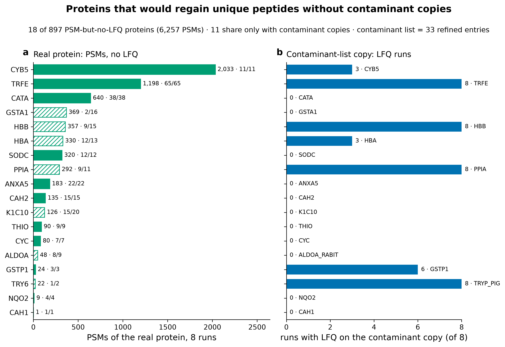
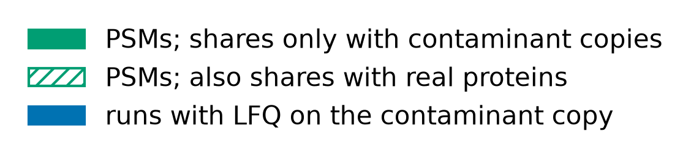

# At least 18 real human proteins (including CYB5) lose their FlashLFQ quantity because they share all peptides with human-protein copies in the search's contaminant list

## Summary
Among the 897 proteins that carry PSMs but never receive a FlashLFQ quantity ([finding 0010](0010-lfq-vs-spectral-abundance-agreement.md)), at least **18 real human proteins** (6,257 PSMs) would gain at least one unique peptide if the contaminant-list copies were removed. **11** of them (4,713 PSMs) share their peptides *only* with contaminant-list copies — led by **CYB5** (2,033 PSMs), TRFE (1,198), and CATA (640) — and for **7** of the 18 the excluded contaminant entry actually carries the LFQ intensity in place of the real protein. The root cause is a cRAP-style contaminant FASTA that contains human proteins sharing tryptic peptides with real database entries; the Stage-3 33-entry no-accession contaminant rule then excludes those copies, and FlashLFQ (unique-peptides-only) is left with nothing to quantify for the real protein.

## Verdict
This is a concrete data-integrity caveat for label-free quantification on this search. Several real human proteins — most notably CYB5, an abundant microsomal protein and raloxifene-adduct target — are simply **absent** from the FlashLFQ results because human proteins in the contaminant list steal all their unique peptides, and for some the contaminant copy is booked the intensity instead. The effect is confined to LFQ: PSM counts and NSAF retain these proteins. The proper fix is **upstream** — re-search and re-run FlashLFQ with a contaminant FASTA that contains no human proteins — which produces a **new data version** and is out of scope for this dataset; the scientist chose to record the caveat and fix it later.

## Caveats and evidence

**At least 18 real human proteins lose LFQ to contaminant-list copies; 11 exclusively so, and 7 have the intensity booked to the contaminant.** Applying the refined 33-entry contaminant rule to the 897 PSM-but-no-LFQ proteins, 18 would recover ≥1 unique peptide if the contaminant copies were removed (6,257 PSMs). Eleven share peptides *only* with a contaminant copy (4,713 PSMs): CYB5 2,033, TRFE 1,198, CATA 640, SODC 320, ANXA5 183, CAH2 135, THIO 90, CYC 80, GSTP1 24, NQO2 9, CAH1 1. The other seven (GSTA1, HBB, HBA, PPIA, K1C10, ALDOA, TRY6) also share with real paralogs. For seven of the eighteen the contaminant copy carries the LFQ instead of the real protein — TRFE/HBB/PPIA/TRY6 in all 8 runs, CYB5/HBA in 3, GSTP1 in 6.

*Figure 1. Contaminant-list human proteins that steal LFQ. Produced by `scripts/scratch/fig_abundance_agreement.py` (6f1631b) from data `sha256:bc6b73d3…` (table `results/abundance-agreement/contaminant_sharing_corrected.tsv`).*

Reading top to bottom by PSM depth: CYB5 sits at the top with 2,033 PSMs and no LFQ, all 11 of its peptide rows shared with a contaminant CYB5 copy that itself carries the intensity in 3 runs; TRFE and CATA follow, and the exclusive-sharing / carrier-takes-LFQ markers show that for many of these the real protein is not merely unquantified but has had its intensity re-assigned to a contaminant entry. These are exactly the high-PSM shared-peptide-only offenders labeled in [finding 0010](0010-lfq-vs-spectral-abundance-agreement.md)'s detection panel.

**This is a subset of a looser count.** A wider "68 proteins share ≥1 peptide with a contaminant entry" figure exists, but most of those also share with real paralogs, so removing the contaminant copy would not recover a unique peptide; the 18 here are the proteins for which contaminant removal genuinely restores quantifiability.

## Methods / how to produce
The affected set is read from `results/abundance-agreement/contaminant_sharing_corrected.tsv` (produced under commit 6f1631b via `scripts/scratch/abundance_agreement.py` / `scripts/scratch/fig_abundance_agreement.py`), data version `sha256:bc6b73d3…`, environment `pyproject.toml + uv.lock` (Python 3.12.3). The refined 33-entry contaminant rule (`protein_loader.refine_contaminants`) reclassifies a peptide row as unique to a real protein P when P is its only non-contaminant member and it has ≥1 contaminant member; a PSM-but-no-LFQ protein is counted as affected when this reclassification would give it ≥1 unique peptide. Carrier-takes-LFQ is determined by whether the contaminant partner entry has a FlashLFQ value in ≥1 run.

## Discussion
The mechanism is a database-construction problem, not a FlashLFQ bug: cRAP-style contaminant FASTAs include human proteins (keratins, hemoglobins, and here CYB5, TRFE, CATA and others), and when a real protein's tryptic peptides are all shared with such a contaminant entry, a unique-peptides-only quantifier has nothing left to integrate for the real protein — and may book the ion current to the contaminant copy. It bears directly on the Stage-2/3 contaminant decision recorded in `state/DATA_DESCRIPTION.md`, and it is why CYB5 — an abundant microsomal cytochrome and a raloxifene covalent-adduct target seen in [finding 0008](0008-raloxifene-cys-adducts-treatment-specific.md) — is invisible to LFQ in both the abundance comparison and any LFQ differential analysis.

## Caveats
- **Exploratory.** A descriptive characterization of the current search's protein inference; no hypothesis test.
- **The proper fix is upstream and out of scope here.** Removing the human proteins from the contaminant FASTA and re-searching / re-running FlashLFQ would recover these proteins, but that is a **new data version**; the scientist chose to record this as a caveat and fix it later.
- **Affects LFQ only.** These proteins are absent from (or misattributed within) the LFQ results — including CYB5 in the abundance comparison of [finding 0010](0010-lfq-vs-spectral-abundance-agreement.md) and any LFQ DE — but PSM counts and NSAF retain them.
- **The 18 is a floor** ("at least"): it is the set for which the refined 33-entry rule cleanly restores a unique peptide; the looser 68-protein superset mixes in real-paralog sharing.

## Follow-ups
- Re-build the search database with a contaminant FASTA stripped of human proteins, re-run FlashLFQ, and re-stamp the data version; then re-point [finding 0010](0010-lfq-vs-spectral-abundance-agreement.md) and any LFQ DE at the corrected version.
- Confirm whether CYB5's adduct-bearing peptides ([finding 0008](0008-raloxifene-cys-adducts-treatment-specific.md)) are among those lost to the contaminant copy.

## Related findings
- Relates to [finding 0010](0010-lfq-vs-spectral-abundance-agreement.md): these 18 proteins are the contaminant-copy subset of the 897 shared-peptide-only proteins that carry PSMs but no LFQ there (Figure 7), and this finding explains why named high-PSM proteins have no LFQ value.
- Relates to [finding 0008](0008-raloxifene-cys-adducts-treatment-specific.md): CYB5, the largest affected protein, is an abundant microsomal raloxifene-adduct target — the covalent chemistry surfaced there concerns a protein that is invisible to LFQ for this reason.

## References
None.
